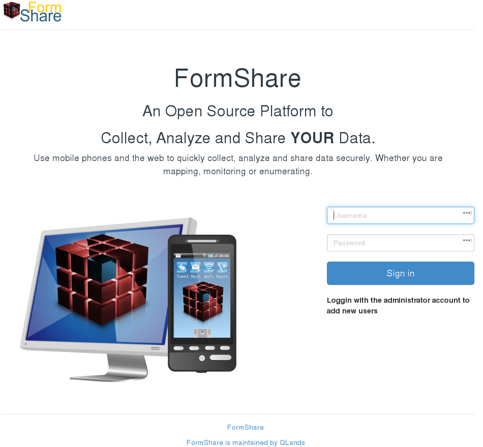

[](https://circleci.com/gh/qlands/FormShare)
[](https://app.codecov.io/gh/qlands/FormShare/commits?page=1)
[](https://github.com/python/black)

FormShare 2
=========

The future of FormHub

Centralize data – Decentralize knowledge<sup>TM</sup>

About
-----
FormShare 2 is an advanced data management platform for [Open Data Kit (ODK)](https://getodk.org/). FormShare 2 is inspired by the excellent [FormHub](<http://github.com/SEL-Columbia/formhub>) platform developed by the Sustainable Engineering Lab at Columbia University. After I forked [OnaData](https://github.com/onaio/onadata) (a fork of FormHub) back in 2016 it was clear that the code needed a lot to bring it to the main ideas that I had: 1) Integrate it with [ODK Tools](https://github.com/qlands/odktools), 2) provide a proper MySQL repository to centralize the data and, 3) use latest software technologies to decentralize the management.

FormShare was created because:

* I want to provide an open-source and **free** platform to private and public organizations to help them manage their data when using ODK.
* ODK Aggregate, in my personal opinion, is badly designed, buggy, and not interoperable. ODK Central, though is an enormous improvement to Aggregate, does not parse arbitrary schemata into database tables which makes data cleaning very cumbersome (e. g., cleaning data through Enketo).
* Forks based on FormHub suffer from the same ills of their father: Django (sorry if I hurt your feelings), no proper repository, rudimentary data cleaning, no auditing, little interoperability, poor or none extensibility... among many others.

FormShare 2 has been written from scratch (not a single line of code comes from Formhub, just ideas, and principles) using Python 3, [Pyramid](https://trypyramid.com/), MySQL, [Elasticsearch](https://www.elastic.co/Elasticsearch/), and [PyUtilib](https://github.com/PyUtilib/pyutilib) to deliver a complete and extensible data management solution for ODK Data collection. It took us three years but is finally here :-) and it is Django free!

FormShare **is for organizations** to install it in their server or cloud service to serve ODK XForms and collect and manage the submissions. FormShare is also available as a service at [https://formshare.org](https://formshare.org) for those organizations that lack the capacity or resources to run their installation.

## Features

**Current features**

- Case management (Longitudinal data collection) (Version >= 2.8.0)
  - Using the Official ODK Collect App
  - Intelligent work flow using Official ODK standards: 
    - Case creator forms will create cases.
    - Follow-up forms will attach information to each case.
    - Deactivate forms will deactivate cases. For example, a household that decides to exit a longitudinal study will not appear in follow-up forms after deactivation.
    - Activate forms will activate cases again.  For example, a household that decides to re-enter a longitudinal study will appear again in follow-up forms after activation.
    - Move information from case creator forms into follow-up, deactivation and activation forms. For example, the sex of a participant (e. g., female) could be used in follow-up case forms to ask specific questions according to sex (e. g., if female, do they have access to reproductive health services since our last visit?)
- User accounts and management
- Group-based user permissions
- Projects to organize users, permissions, and forms
- Separate access for data collectors and data cleaners. This is useful when dealing with hundreds of data collectors that do not need a FormShare user access 
- User collaborations at project level, e. g., you can allow a colleague to maintain certain aspects of your project.
- Form and submission management
  - With easy setup of ODK Collect using QR images
  - With support for form version updates
  - With testing and production stages
  - With form and submission multimedia or data attachments
  - With a table preview of submission data (even with thousand or millions of records) allowing in-table edits and recording any changes made to the data
- OData live data feed for analysis with tools like Excel and Power BI. **With all CRUD operation supported (e. g., update)**. You can even use [Excel](https://github.com/qlands/MrBot-OData-Add-In) to clean data.
- Extensibility system, e. g., You can write extensions to connect FormShare with Microsoft 365 authentication system
- Documentation for running on AWS using Docker
- Data cleaning API integration with R, STATA, or SPSS
- Real-time map visualization of geo-referenced submissions at project and form level
- Fill out forms using the web browser through [Enketo](https://github.com/qlands/formshare_enketo_plugin)
- Download form attachments
- Filtering submissions by submission metadata (e. g., date and time received on server)
- Parse submissions into database tables. FormShare will create a MySQL data repository to store your data
  - The repository is controlled with a primary key e. g., Farmed ID
  - Duplicated submissions go to a cleaning pipe-line system that makes it easier to compare submissions and decide what to do with the duplicates
- Private and publishable data downloads in Excel and CSV formats
  - Mark data fields as sensitive to exclude them from publishable products
  - Version control on products, e. g., FormShare will let you know if a data export does not have the latest submissions or changes in the database
  - Make publishable products publicly available knowing that sensitive fields are excluded automatically 
- Download geo-referenced information in KML format

**Short-term features:**

- Graph visualization with dashboards.
- Connecting data fields with ontological variables. This is useful when comparing variables across studies even if variable names are different
- Real-time data aggregation (pull data from different forms into one common data bucket). This is useful when dealing with slightly different forms for different geographies but where that certain fields could be aggregated into a common pot for analysis
- Real-time data cleaning scripts using R

ScreenShot
----------



Releases
------------
The current stable release is 2.8.3 and it is available [here](https://github.com/qlands/FormShare/tree/stable-2.8.3) 

The database signature for stable 2.8.3 is 3dd1ebdcd7e0

The Docker image for stable 2.8.3 is 20210708

Installation
------------
Please read the [installation guide](install_steps.txt) if you want to install FormShare manually. However, we encourage you to use the Docker Compose file available in the docker_compose directory. This will help you later on in backing FormShare or move it to another server.

The below is a common recipe for running FormShare using docker:

```shell
# From a fresh installation of Ubuntu 18.04.03 from https://ubuntu.com/download/server
# Update the repositories and packages
sudo add-apt-repository multiverse
sudo apt-get update
sudo apt-get -y upgrade

# Install docker-compose
sudo apt-get install -y docker-compose

# Get the Docker Compose file
cd /opt
sudo mkdir formshare_docker_compose_20210708
cd formshare_docker_compose_20210708
sudo wget https://raw.githubusercontent.com/qlands/FormShare/stable-2.8.3/docker_compose/docker-compose.yml

# Make the directory structure for FormShare
sudo mkdir /opt/formshare
whoami=$(whoami)
sudo chown $whoami /opt/formshare
mkdir /opt/formshare/celery
mkdir /opt/formshare/log
mkdir /opt/formshare/repository
mkdir /opt/formshare/config
mkdir /opt/formshare/mysql
mkdir /opt/formshare/plugins
mkdir /opt/formshare/elasticsearch
mkdir /opt/formshare/elasticsearch/esdata
mkdir /opt/formshare/elasticsearch/esdata2
mkdir /opt/formshare/elasticsearch/esdata3
sudo chmod -R g+w /opt/formshare

# Set enough memory for Elasticsearch
sudo sysctl -w vm.max_map_count=262144
echo 'vm.max_map_count=262144' | sudo tee -a /etc/sysctl.d/60-vm-max_map_count.conf

# Download all the required Docker Images
cd /opt/formshare_docker_compose_20210708
sudo docker-compose pull

# Edit the docker-compose.yml file to set the MySQL root and FormShare admin passwords
sudo nano /opt/formshare_docker_compose_20210708/docker-compose.yml
# Press Alt+Shit+3 to show the line numbers in Nano

Edit line 10: Change the root password from "my_secure_password" to your password
Edit line 61: Change the root password from "my_secure_password" to the same password of line 10
Edit line 62: Change the admin user name (optional)
Edit line 63: Change the admin email address
Edit line 64: Change the admin user password from "my_secure_password" to your password
Edit line 69: Change the IP address for the IP address of the machine running the Docker service

# Save the file with Ctlr+o Enter . Exit with Ctrl+x

# In AWS if you use MySQL >= 8 in a RDS service you need to add the following permissions to your RDS root user:
# GRANT SESSION_VARIABLES_ADMIN ON *.* TO 'my_RDS_root_user'@'%';
# GRANT SYSTEM_VARIABLES_ADMIN ON *.* TO 'my_RDS_root_user'@'%';

# Install Apache Server
sudo apt-get install -y apache2

# Enable proxy for Apache
sudo ln -s /etc/apache2/mods-available/proxy.conf /etc/apache2/mods-enabled/
sudo ln -s /etc/apache2/mods-available/proxy.load /etc/apache2/mods-enabled/
sudo ln -s /etc/apache2/mods-available/proxy_http.load /etc/apache2/mods-enabled/

# Edit the apache configuration to proxy pass FormShare 
sudo nano /etc/apache2/sites-enabled/000-default.conf
# Add the following lines after line 28
        ProxyRequests Off
        ProxyPreserveHost On
   
        ProxyPass           /formshare    http://127.0.0.1:5900/formshare
        ProxyPassReverse    /formshare    http://127.0.0.1:5900/formshare
  
        <Proxy *>
           allow from all
        </Proxy>
        ProxyTimeout 120
           
# Save the file with Ctlr+o Enter . Exit with Ctrl+x
# Stop the Apache server
sudo service apache2 stop
# Start the Apache server
sudo service apache2 start

# Start the FormShare containers. The first time you start the container FormShare will construct the database and apply all updates. This will take about 5 minutes.
# Subsequent start will take about 2 minutes. You can check the status with "sudo docker stats". 
# FormShare will be ready for usage when the container reaches more than 500 kB of MEM USAGE
# This is the only two commands you need to start FormShare after a server restart
cd /opt/formshare_docker_compose_20210708
sudo docker-compose up -d

# Browse to FormShare
http://[this server IP address]/formshare
```

## Install plug-ins while using Docker (images > 20200306)

All plug-ins must be deployed in the directory /opt/formshare/plugins which is a volume in all the provided docker compose files.

```sh
# Grab the container ID running FormShare
sudo docker stats
# Get into the container
sudo docker exec -it [formshare_container_id] /bin/bash
# Activate the environment
source /opt/formshare_env/bin/activate
# Go to the plugins directory
cd /opt/formshare_plugins
# For each plugin run develop
python setup.py develop
# For each plugin compile the language catalogs
python setup.py compile_catalog
# Stop FormShare
cd /opt/formshare_gunicorn
pkill -F ./formshare.pid
# Edit the file /opt/formshare/config/development.ini and enable the plug-ins
sudo nano /opt/formshare/config/development.ini
# Start FormShare
cd /opt/formshare_gunicorn
./run_server.sh
# Exit the docker container
```

**Important Note:** You may need to repeat these steps if the FormShare container gets updated or if you update FormShare. Use the information in "Upgrading information" if this is the case.

## Upgrading information

### Important Note: Upgrading Docker images < **20210411** (stable 2.8.0) to images >= **20210411**

Docker images >= 20210411 (stable 2.8.0) use and check for Elasticsearch version 6.8.14. To upgrade FormShare beyond 20210411 you need to update the docker-compose.yml to use the Docker image 6.8.14 of Elasticsearch **for all the nodes of Elasticsearch that you have**.

```yaml
image: docker.elastic.co/Elasticsearch/Elasticsearch:6.8.14
```

### Upgrading steps

Please read the [upgrade guide](upgrade_steps.txt) if you have FormShare installed from the source code. If you use Docker then things are easier:

```sh
# Make a backup of your installation. See the section "Backup FormShare"

# Edit the file /opt/formshare/config/development.ini and disable all plug-ins
sudo nano /opt/formshare/config/development.ini

# Copy the current docker compose file to a new one. For example, [current_docker_image] could be 20210708 and [new_docker_image] will be 20210708
cd /opt
sudo cp -R formshare_docker_compose_[current_docker_image] formshare_docker_compose_[new_docker_image]

# Edit the /opt/formshare_docker_compose_[new_docker_image]/docker-compose.yml and change all the references of [current_docker_image] to [new_docker_image]. For example change all  20210708 for 20210708
# If you are upgrading from Docker images <= 20210708 to images > 20210708 then you need to also update the Docker image of Elasticsearch to 6.8.14
sudo /opt/formshare_docker_compose_[new_docker_image]/docker-compose.yml

# Remove the old Docker Network.
sudo docker network rm docker[current_docker_image]_fsnet

# Start the new version of FormShare. All required updates in the database will be done automatically.
cd /opt/formshare_docker_compose_XXXXXXXX
sudo docker-compose up

# If you have plug-ins then you need to build them and enable them again. See the section "Install plug-ins while using Docker"

```


## How to make your FormShare installation inaccessible, inconsistent, and/or broken.

FormShare uses MySQL, Elasticsearch, and a file repository. **All of them are synchronized**, thus the following list of things may make your FormShare installation inaccessible, inconsistent and/or broken:

- Altering the database manually, for example, removing/adding users or forms
- Removing files manually from the repository 
- Changing the encryption key (aes.key) in the development.ini file.
- Deleting or changing the Elasticsearch index data
- Upgrading Elasticsearch to a version that is not supported.
- Deleting the repository

## Backup FormShare

FormShare uses MySQL, Elasticsearch, and a file repository. **All of them are synchronized**. To backup FormShare do:

- Stop the FormShare service and all the Docker containers
- Use mysqldump to backup the schema called "formshare" 
- Use mysqldump to backup all schemata starting with "FS" (optional: Only if you are migrating FormShare to a new server)
- If you used any of the provided Docker compose files then backup the directory /opt/formshare
- If you did not use Docker then:
  - Backup the development.ini file
  - Backup the Elasticsearch data directory or create a [snapshot](https://www.elastic.co/guide/en/Elasticsearch/reference/6.1/modules-snapshots.html#_snapshot)  of the following indexes:
    - formshare_*
    - [user]_[project]_*
  - Backup the file repository directory

Contributing
------------

The best way to contribute to FormShare is by testing it and posting issues. If you can fix things do the following:

1. Fork FormShare
2. Clone your fork in your local computer
3. Create a branch for your fix **based on the master branch**
4. Create the fix, commit the code, and push the branch to your forked repository
5. Create a pull request

We also appreciate and need translation files. See the Localization section.

Customization and Extension
------------
FormShare uses [PyUtilib Component Architecture](http://citeseerx.ist.psu.edu/viewdoc/download?doi=10.1.1.616.8737&rep=rep1&type=pdf) to allow customization and extension. The best way to do it is by using the [FormShare Plugin CookieCutter](https://github.com/qlands/formshare-cookiecutter-plugin) and explore the different Interfaces.

What can you do through extension plug-ins? Some ideas:

- Integrate the FormShare login with your company Windows Authentication.
- Change the colors, logos, and all aspects of the user interface.
- Integrate messaging services like WhatsApp to inform field agents when a new version of a form is up.
- Collect data using USSD or IVR services with the same ODK form and store the data in the same repository no matter the source.
- Implement longitudinal surveys where the data of a form is pulled to populate the options of another form.

You basically can extend FormShare to fit your needs. We are working on proper documentation for this.

Some examples of plug-ins are:

- [OData](https://github.com/qlands/formshare_odata_plugin). This plug-in will create [OData](https://www.odata.org/) services for each FormShare repository that you have. An OData service has many advantages but most importantly it allows you to access your data in real-time from platforms like [Tableau](https://public.tableau.com/en-us/s/) and [Power BI](https://powerbi.microsoft.com/en-us/). You can also use it to [clean data from Excel](https://github.com/qlands/MrBot-OData-Add-In).
- [Enketo](https://github.com/qlands/formshare_enketo_plugin). This plug-in will allow you to collect ODK data using the Internet Browser through [Enketo](https://enketo.org/). This plug-in is useful for users that cannot use ODK Collect.


Localization
------------

FormShare comes out of the box in English, Spanish, French, and Portuguese. It uses Babel for translation and you can help us by creating new translations or by correcting an existing one.

To generate a new translation:


    $ cd formshare
    $ python setup.py init_catalog -l [new_language_ISO_639-1_code]
    $ python setup.py extract_messages
    $ python setup.py update_catalog

The translation files (.po) are available at formshare/locale/[language-code]/LC_MESSAGES. You can edit a .po file with tools like [PoEdit](https://poedit.net/download), [Lokalize](https://userbase.kde.org/Lokalize), [GTranslator](https://gitlab.gnome.org/GNOME/gtranslator), or a simple text editor. Once the translation is done you can send us the updated or new .po file as an issue and we will add it to FormShare.

## License

FormShare is released under the terms of the GNU Affero General Public License. 

The plug-in mechanism since it is based on PyUtilib is covered by a [BSD type of license](https://github.com/PyUtilib/pyutilib/blob/master/LICENSE.txt).