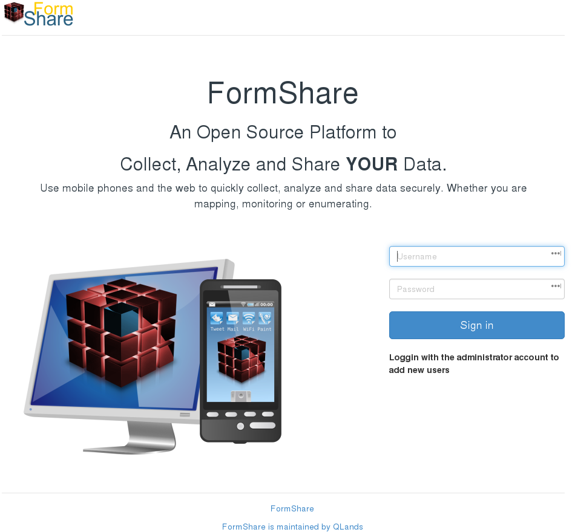

[](https://circleci.com/gh/qlands/FormShare)
[](https://app.codecov.io/gh/qlands/FormShare/commits?page=1)
[](https://github.com/python/black)

FormShare<sup>®</sup>
=========

Centralize data – Decentralize knowledge<sup>TM</sup>

About
-----
FormShare is an advanced data management platform for [Open Data Kit (ODK)](https://getodk.org/). FormShare is inspired by the excellent [FormHub](<http://github.com/SEL-Columbia/formhub>) platform developed by the Sustainable Engineering Lab at Columbia University. After we forked [OnaData](https://github.com/onaio/onadata) (a fork of FormHub) back in 2016 it was clear that the code needed a lot to bring it to a complete data management platform.

FormShare has been written from scratch (reimplementing ideas, principles, and logic) using Python 3, [FastAPI](https://github.com/fastapi/fastapi), MySQL, [Elasticsearch](https://www.elastic.co/Elasticsearch/), and [PyUtilib](https://github.com/qlands/pyutilib) to deliver a complete and extensible data management solution for ODK Data collection.

FormShare Community Server is available at [https://formshare.org](https://formshare.org) for students and very small organizations. FormShare SaaS is available at https://www.qlands.com/plans

For more information visit at [www.qlands.com](https://www.qlands.com/)

## Features

### Case management (Longitudinal data collection) (Version >= 2.8.0)

- Using the Official ODK Collect App.
- Intelligent workflow using Official ODK standards: 
  - Case creator forms will create cases.
  - Follow-up forms will attach information to each case.
  - Deactivate forms will deactivate cases. For example, a household that decides to exit a longitudinal study will not appear in follow-up forms after deactivation.
  - Activate forms will activate cases again.  For example, a household that decides to re-enter a longitudinal study will appear again in follow-up forms after activation.
  - Move information from case creator forms into follow-up, deactivation, and activation forms. For example, the sex of a participant (e. g., female) could be used in follow-up case forms to ask specific questions according to sex (e. g., if female, do they have access to reproductive health services since our last visit?)

### Support for multiple time zones

FormShare can produce dates and times in the following time zones:

- FormShare: This is the time zone of the Linux server running FormShare.
- User: This is the time zone of a user logged into FormShare.
- Project: Each project can have a different time zone. This should be the time zone where submissions happen.
- Assistant: This is the time zone of an assistant logged into FormShare.
- Partner: This is the time zone of a partner logged into FormShare.

### User and project management

- User accounts and management.
- Group-based user permissions.
- Projects to organize users, permissions, and forms.
- Separate access for data collectors and data cleaners. This is useful when dealing with hundreds of data collectors that do not need a FormShare user's account.
- Separate access for partners: Partners are trusted individuals outside your organization that require access to products and other resources in FormShare to collaborate with you. For example, a professor at a university (a partner in your project) requires a KML export to match GPS points with weather data. 
- User collaborations at a project level, e.g., you can allow a colleague to maintain certain aspects of your project.

### Form and submission management

- Easy setup of ODK Collect Projects using configurable QR images.
- Support for form version updates.
- With testing and production stages.
- Showing structural changes between incremental versions.
- With form and submission multimedia or data attachments.
- Table preview of submission data (even with thousands or millions of records) allowing in-table edits and recording any changes made to the data.
- Fill out forms using the web browser through [Enketo](https://github.com/qlands/formshare_enketo_plugin).
- Real-time map visualization of geo-referenced submissions at project and form levels.
- Download form attachments.

### Database management and interoperability 

- Parse submissions into database tables. FormShare will create a MySQL data repository to store your data.
  - The repository is controlled with a primary key e.g., Farmed ID.
  - Duplicated submissions go to a cleaning pipeline system that makes it easier to compare submissions and decide what to do with the duplicates.
- Filtering submissions by submission metadata (e.g., date and time received on server).
- Data cleaning API integration with R, STATA, or SPSS.

- Data dictionary with personal information protection (PII filtering).

### Product management

- Private and publishable data downloads in Excel, CSV, and JSON formats.
  - Publishable products exclude protected fields (personal information protection) automatically.
  - Version control on products, e.g., FormShare will let you know if a data export does not have the latest submissions or changes in the database.
- Download geo-referenced information in KML format.

### Performance, concurrency, and parallelism

Though FormShare with the default settings can handle a load that would fit most organizations, it can be configured to handle any load. FormShare has been tested, using [JMeter](https://jmeter.apache.org/), under extreme traffic (100 parallel submissions loading 50,000 submissions).

- Each submission is transactional. This means that a submission is either processed completely or thoroughly discarded for ODK Collect to re-send it.
- Under extreme traffic,  FormShare can store 50,000 submissions of a complex survey like [RHoMIS](https://www.rhomis.org/) in 11 minutes. This is around 75 submissions per second or storing one full RHoMIS survey relationally, query-able and indexed in 0.0132 seconds.
- Data exports support concurrent processing. A survey like RHoMIS with 100,000 submissions and millions of rows would take less than a minute to export to JSON or CSV.
- The performance of the user interface or the data cleaning interface is not affected by the number of submissions. With FormShare you can have 1,000,000 submissions with GPS points and it will not delay that user interface. 

### Extensibility and others

- Extensibility system, e.g., You can write extensions to connect FormShare with Microsoft 365 authentication system. See a list of extensions [below](#Customization-and-Extension).
- Documentation for running on AWS using Docker.
- Data fields tagged with ontological codes. This is useful when comparing variables across studies even if variable names are different.


ScreenShot
----------



Releases
------------
The current stable release is 3.0.0 and it is available [here](https://github.com/qlands/FormShare/tree/stable-3.0.0) 

The database signature for stable 3.0.0 is 6e8f0f158657

The Docker image for stable 3.0.0 is 20260409

**Never upgrade FormShare from one Docker image to another without checking the "Upgrading information" section below.**

Installation
------------
Install FormShare using the Docker Compose files available in the docker_compose directory. 

The below is a common recipe for running FormShare using docker:

```shell
# From a fresh installation of Ubuntu 22.04 from https://ubuntu.com/download/server
# Update the repositories and packages
sudo add-apt-repository multiverse
sudo apt-get update
sudo apt-get -y upgrade

# Install docker-compose
sudo apt-get install -y docker-compose

# Get the Docker Compose files
cd /opt
sudo mkdir formshare_community
cd formshare_community
sudo wget https://raw.githubusercontent.com/qlands/FormShare/refs/heads/master-3.0/docker_compose/servers.yml
sudo wget https://raw.githubusercontent.com/qlands/FormShare/refs/heads/master-3.0/docker_compose/formshare.yml
sudo wget https://raw.githubusercontent.com/qlands/FormShare/refs/heads/master-3.0/docker_compose/env.example

# Make the directory structure for FormShare
sudo mkdir -p /opt/formshare_community/celery
sudo mkdir -p /opt/formshare_community/log
sudo mkdir -p /opt/formshare_community/repository
sudo mkdir -p /opt/formshare_community/config
sudo mkdir -p /opt/formshare_community/mysql
sudo mkdir -p /opt/formshare_community/plugins
sudo mkdir -p /opt/formshare_community/elasticsearch/certs
sudo mkdir -p /opt/formshare_community/elasticsearch/esdata
sudo mkdir -p /opt/formshare_community/elasticsearch/esdata2
sudo chmod -R g+w /opt/formshare_community

# Install docker-compose and give it enough memory
sudo sysctl -w vm.max_map_count=262144
echo 'vm.max_map_count=262144' | sudo tee -a /etc/sysctl.d/60-vm-max_map_count.conf

# Create a .env file using the example
sudo mv env.example .env

# Edit .env file to change:
# -The mysql security credentials:
MYSQL_USER_NAME=root
MYSQL_ROOT_PASSWORD=change_me_mysql_root
MYSQL_USER_PASSWORD=change_me_mysql_root

#- The Elasticsearch security credentials:
ELASTIC_PASSWORD=change_me_elastic

#-The admin credentials:
FORMSHARE_ADMIN_USER=admin
FORMSHARE_ADMIN_EMAIL=admin@myserver.com
FORMSHARE_ADMIN_PASSWORD=change_me_admin

#Start MySQL and Elasticsearch
sudo docker-compose --env-file .env -f servers.yml up -d

#Start FormShare
sudo docker-compose --env-file .env -f formshare.yml up -d

#Docker will pull the necessary images and run FormShare. After all images are pulled and
#all services run, you will be able to access FormShare at http://localhost:5900/.

# RDS Notes:
# In AWS if you use MySQL >= 8 in a RDS service you need to add the following permissions to your RDS root user:
# GRANT SESSION_VARIABLES_ADMIN ON *.* TO 'my_RDS_root_user'@'%';
# GRANT SYSTEM_VARIABLES_ADMIN ON *.* TO 'my_RDS_root_user'@'%';
```

## Install plug-ins while using Docker (images > 20200306)

All plug-ins must be deployed in the directory /opt/formshare/plugins which is a volume in all the provided docker compose files.

```sh
# Grab the container ID running FormShare
sudo docker stats
# Get into the container
sudo docker exec -it formshare_app /bin/bash
# Activate the environment
source /opt/formshare_env/bin/activate
# Go to the plugins directory
cd /opt/formshare_plugins
# For each plugin run develop
pip install -e .
# For each plugin compile the language catalogs
python setup.py compile_catalog
# Stop FormShare
cd /opt/formshare_uvicorn
pkill -F ./formshare.pid
# Edit the file /opt/formshare/config/development.ini and enable the plug-ins
sudo nano /opt/formshare/config/development.ini
# Start FormShare
cd /opt/formshare_unicorn
./run_server.sh
# Exit the docker container
```

**Important Note:** You may need to repeat these steps if the FormShare container gets updated or if you update FormShare. Use the information in "Upgrading information" if this is the case.

## Upgrading information

### Important Note: MySQL and Redis Session - Migration 1 - Upgrading FormShare to a version > 2.44.0

Versions of FormShare > 2.44.0 use MySQL 8.4.7 that requires TLS and removed "mysql_native_password". It also upgraded Redis Sessions to 1.8.1. Settings must be modified manually:

1. Modify "sqlalchemy.url" in the settings file to remove "ssl_disabled=True" from the URI
2. Modify the file "mysql.cnf" to remove the lines "ssl-mode = DISABLED"
3. Modify "redis.sessions.host" to read "redis.sessions.redis_host"
4. Modify "redis.sessions.port" to read "redis.sessions.redis_port"

### Important Note: Elasticsearch - Migration 3 - Upgrading FormShare to a version > 2.44.0

Versions of FormShare > 2.44.0 use Elasticsearch 9.2.1. There is no automatic migration from Elasticsearch 7.14.2 to 9.2.1. Indexes must be migrated manually:

1. Upgrade 7.14.2 → 7.17.x (or latest 7.X). Check the deprecations logs using "GET _migration/deprecations" 
2. Upgrade 7.17.x → 8.12.x (or latest 8.x). This is a clean jump.
3. Update your Docker environment to handle TLS certificates and ELASTIC_PASSWORD
4. Check the deprecations logs.
5. Upgrade 8.x → 9.2.X. This jump is smooth *as long as* you fixed deprecations in the previous step.


### Important Note: Elasticsearch - Migration 2 - Upgrading Docker images >= 20211019

Docker images >= 20211019 (from stable 2.10.0) use and check for Elasticsearch version 7.14.X. To upgrade FormShare beyond 20211019 you need to update the docker-compose.yml to use the Docker image 7.14.X of Elasticsearch **for all the nodes of Elasticsearch that you have**. **If you are upgrading from images < 20210801 then you need  to perform perform migration 1 first (see below)**.  You also need to update the configuration of your nodes:

**Old configuration** (images < 20211109):

```yaml
fselasticsearch_20210805:
    image: docker.elastic.co/elasticsearch/elasticsearch:6.8.14
    container_name: fs_elasticsearch_20210805
    environment:
      - cluster.name=docker-cluster
      - bootstrap.memory_lock=true
      - "ES_JAVA_OPTS=-Xms512m -Xmx512m"
      - network.host=172.28.1.1
      - "discovery.zen.minimum_master_nodes=2"
    ulimits:
      memlock:
        soft: -1
        hard: -1
    volumes:
      - /opt/formshare/elasticsearch/esdata:/usr/share/elasticsearch/data
    networks:
      fsnet:
        ipv4_address: 172.28.1.1

  fselasticsearch2_20210805:
    image: docker.elastic.co/elasticsearch/elasticsearch:6.8.14
    container_name: fs_elasticsearch2_20210805
    environment:
      - cluster.name=docker-cluster
      - bootstrap.memory_lock=true
      - network.host=172.28.1.2
      - "ES_JAVA_OPTS=-Xms512m -Xmx512m"
      - "discovery.zen.ping.unicast.hosts=172.28.1.1"
    ulimits:
      memlock:
        soft: -1
        hard: -1
    volumes:
      - /opt/formshare/elasticsearch/esdata2:/usr/share/elasticsearch/data
    networks:
      fsnet:
        ipv4_address: 172.28.1.2
```

**New configuration** (images >= 20211009):

```yaml
fses20211019n01:
    image: docker.elastic.co/elasticsearch/elasticsearch:7.14.2
    container_name: fses20211019n01
    environment:
      - network.host=172.28.1.1
      - node.name=fses20211019n01
      - cluster.name=fs-es-cluster
      - discovery.seed_hosts=fses20211019n02
      - cluster.initial_master_nodes=fses20211019n01,fses20211019n02
      - bootstrap.memory_lock=true
      - xpack.security.enabled=false
      - "ES_JAVA_OPTS=-Xms512m -Xmx512m"
    ulimits:
      memlock:
        soft: -1
        hard: -1
    volumes:
      - /opt/formshare/elasticsearch/esdata:/usr/share/elasticsearch/data
    networks:
      fsnet:
        ipv4_address: 172.28.1.1

  fses20211019n02:
    image: docker.elastic.co/elasticsearch/elasticsearch:7.14.2
    container_name: fses20211019n02
    environment:
      - network.host=172.28.1.2
      - node.name=fses20211019n02
      - cluster.name=fs-es-cluster
      - discovery.seed_hosts=fses20211019n01
      - cluster.initial_master_nodes=fses20211019n01,fses20211019n02
      - bootstrap.memory_lock=true
      - xpack.security.enabled=false
      - "ES_JAVA_OPTS=-Xms512m -Xmx512m"
    ulimits:
      memlock:
        soft: -1
        hard: -1
    volumes:
      - /opt/formshare/elasticsearch/esdata2:/usr/share/elasticsearch/data
    networks:
      fsnet:
        ipv4_address: 172.28.1.2
```

Note that the container names have no special characters and the way Nodes are discovered change in ES 7.14.X

### Important Note: Elasticsearch - Migration 1 - Upgrading Docker images < **20210411** (stable 2.8.0) to images >= **20210411**

Docker images >= 20210411 (from stable 2.8.0) use and check for Elasticsearch version 6.8.14. To upgrade FormShare beyond 20210411 you need to update the docker-compose.yml to use the Docker image 6.8.14 of Elasticsearch **for all the nodes of Elasticsearch that you have**.

```yaml
image: docker.elastic.co/Elasticsearch/Elasticsearch:6.8.14
```

### Upgrading steps

```sh
# Make a backup of your installation. See the section "Backup FormShare"

# Edit the file /opt/formshare/config/development.ini and disable all plug-ins
sudo nano /opt/formshare/config/development.ini

# Edit the .env file 
# Change the FORMSHARE_IMAGE to the lastest image of FormShare Community

# Start the Docker container again

# If you have plug-ins then you need to build them and enable them again. See the section "Install plug-ins while using Docker"

```


## How to make your FormShare installation inaccessible, inconsistent, or broken.

FormShare uses MySQL, Elasticsearch, and a file repository. **All of them are synchronized**, thus the following list of things may make your FormShare installation inaccessible, inconsistent and/or broken:

- Altering the database manually, for example, removing/adding users or forms
- Removing files manually from the repository 
- Changing the encryption key (aes.key) in the development.ini file.
- Deleting or changing the Elasticsearch index data
- Upgrading Elasticsearch to a version that is not supported.
- Deleting the repository

## Backup FormShare

FormShare uses MySQL, Elasticsearch, and a file repository. **All of them are synchronized**. To backup FormShare do:

- Stop the FormShare service and all the Docker containers
- Use mysqldump to backup the schema called "formshare" 
- Use mysqldump to backup all schemata starting with "FS" (optional: Only if you are migrating FormShare to a new server)
- If you used any of the provided Docker compose files then backup the directory /opt/formshare
- If you did not use Docker then:
  - Backup the development.ini file
  - Backup the Elasticsearch data directory or create a [snapshot](https://www.elastic.co/guide/en/Elasticsearch/reference/6.1/modules-snapshots.html#_snapshot)  of the following indexes:
    - formshare_*
    - [user]_[project]_*
  - Backup the file repository directory

Contributing
------------

The best way to contribute to FormShare is by testing it and posting issues. If you can fix things do the following:

1. Fork FormShare
2. Clone your fork in your local computer
3. Create a branch for your fix **based on the master branch**
4. Create the fix, commit the code, and push the branch to your forked repository
5. Create a pull request

We also appreciate and need translation files. See the Localization section.

Customization and Extension
------------
FormShare uses [PyUtilib Component Architecture](http://citeseerx.ist.psu.edu/viewdoc/download?doi=10.1.1.616.8737&rep=rep1&type=pdf) to allow customization and extension. The best way to do it is by using the [FormShare Plugin CookieCutter](https://github.com/qlands/formshare-cookiecutter-plugin) and explore the different Interfaces.

What can you do through extension plug-ins? Some ideas:

- Integrate the FormShare login with your company Windows Authentication.
- Change the colors, logos, and all aspects of the user interface.
- Integrate messaging services like WhatsApp to inform field agents when a new version of a form is up.
- Collect data using USSD or IVR services with the same ODK form and store the data in the same repository no matter the source.
- Implement longitudinal surveys where the data of a form is pulled to populate the options of another form.

You basically can extend FormShare to fit your needs.

Some examples of plug-ins are:

- [Enketo](https://github.com/qlands/formshare_enketo_plugin). This plug-in will allow you to collect ODK data using the Internet Browser through [Enketo](https://enketo.org/). This plug-in is useful for users that cannot use ODK Collect.


Localization
------------

FormShare comes out of the box in English, Spanish, French, and Portuguese. It uses Babel for translation and you can help us by creating new translations or by correcting an existing one.

To generate a new translation:


    $ cd formshare
    $ python setup.py init_catalog -l [new_language_ISO_639-1_code]
    $ python setup.py extract_messages
    $ python setup.py update_catalog

The translation files (.po) are available at formshare/locale/[language-code]/LC_MESSAGES. You can edit a .po file with tools like [PoEdit](https://poedit.net/download), [Lokalize](https://userbase.kde.org/Lokalize), [GTranslator](https://gitlab.gnome.org/GNOME/gtranslator), or a simple text editor. Once the translation is done you can send us the updated or new .po file as an issue and we will add it to FormShare.

## License

FormShare is released under the terms of [QLands Open Source License.](./LICENSE.txt) 

The plug-in mechanism since it is based on PyUtilib is covered by a [BSD type of license](https://github.com/PyUtilib/pyutilib/blob/master/LICENSE.txt).
