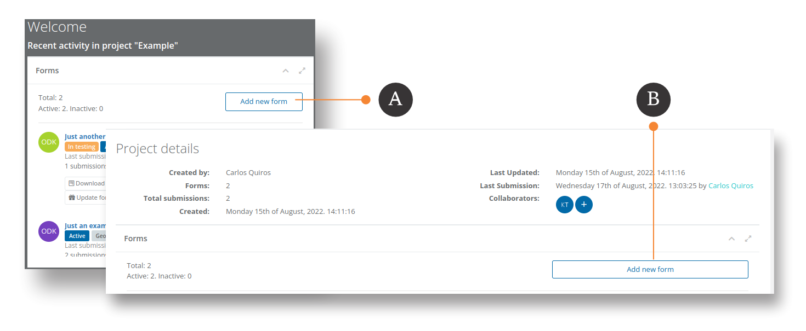
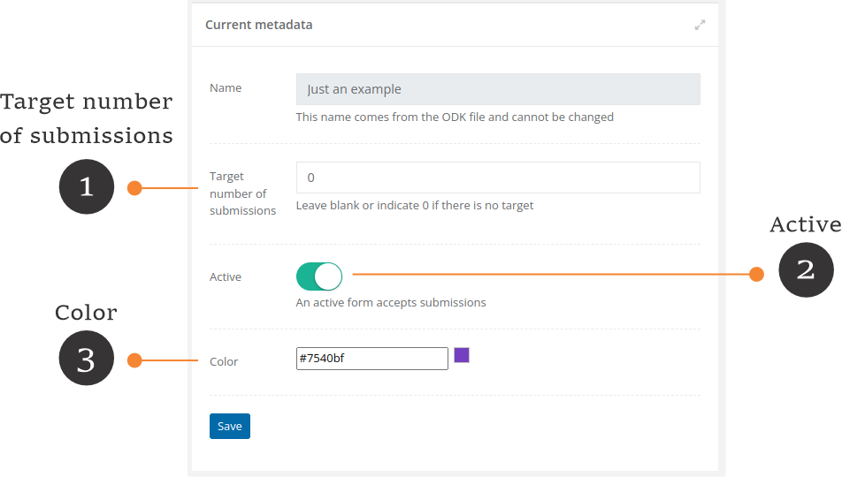
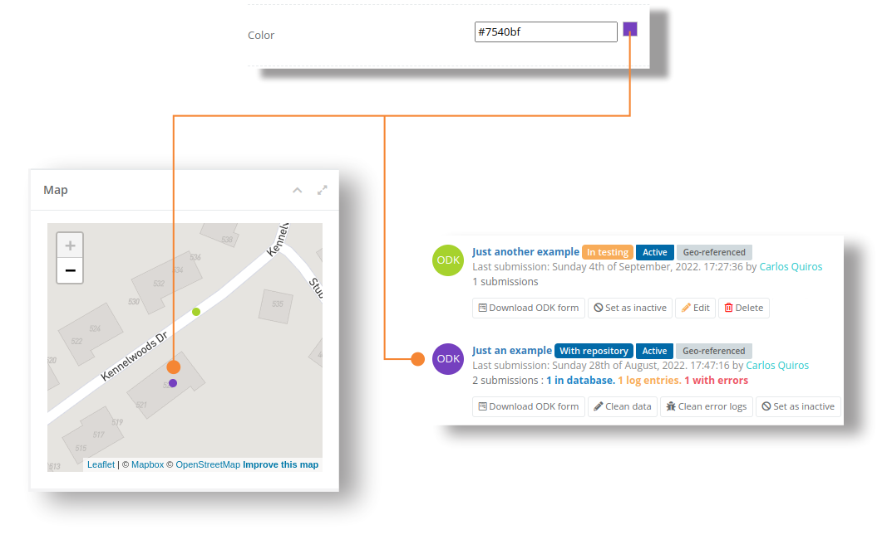

# Forms

FormShare is an advanced data management platform for [Open Data Kit](https://docs.getodk.org/form-design-intro/) (ODK). It works by uploading [ODK XLS/X forms](https://docs.getodk.org/xlsform/) (Excel format). Forms are allocated to one [Project](../projects.md), can have multiple assistants or assistant groups performing data collection or cleaning actions, and can be accessed by multiple [partners](../partners.md).

## Upload forms

You can upload a new form into a project on the Dashboard or on the Project Details page.

<figure><figcaption></figcaption></figure>

A. In the dashboard, click on the "Add new form" button to upload a new form into the **active project**.

B. On the "Project details" page, click on the "Add new form" button to upload a new form into the **current project** showing on the screen.

The "Upload new form" screen will appear.

To upload a new form, you need to provide the following information:

* Survey file (XLS / XLSX): This is the ODK form file in Excel format.
* Variable used to control duplicate submissions: To control duplicate submissions, you need to select a variable from your ODK Form whose values will be **UNIQUE** across all the submissions that you expect to have. If you need to join two or more variables to become UNIQUE, then use an ODK Calculate to merge them into one variable. This variable will become the Primary Key of your ODK Form and CAN NOT BE CHANGED afterward.


**What is duplicate data?**

_Let’s imagine that you are surveying cattle in a rural village and each animal has an ear tag. Two enumerators, James and Patricia go around the village gathering the information for each animal. James and Patricia without realizing it, survey the same animal (the same ear tag) and send the data. To solve this problem and prevent having the same animal twice in our dataset, you can tell FormShare that the ear-tag variable **must be unique**. In this example, the **ear tag is the variable that you will use to control duplicated data**. FormShare will alert you that there is duplicated data, and you will be able to correct it easily._


* Expected number of submissions (optional): If you have a target value of submissions FormShare will show your progress towards that target.

If there are problems with your form, FormShare will tell you the problem and enable you to correct it.&#x20;


**Why my form uploads fine on other platforms but not on FormShare?**

FormShare creates a [MySQL database for each form](../repositories/how-does-formshare-stores-my-data.md). This has several advantages compared to other platforms but it poses more restrictions. For example, the image above indicates that you cannot have a variable called "name". This is because "name" is a restricted keyword in MySQL or SQL language.

The section "[Common errors in a Form](common-errors-in-a-form.md)" provides information about each error that FormShare would detect in your form.


If the form is fine, FormShare will take you to the details of the form. The form will be ready for testing.

## The two stages of a Form

An ODK form in FormShare can be in two stages: "Testing" and "With repository". The main difference is that forms **without a repository** store submissions temporarily as JSON files with limited tools and export options. On the other hand, forms **with a repository** store submissions as relational data in a relational database with ample tools and export options.

### The testing stage

#### Details and tools of form in testing stage

After uploading a new form, FormShare will take make it available in a testing stage. The "Form Details" page will appear.

1\. Testing stage: Every form that you upload to FormShare is stored first in a **testing stage**. This means that FormShare hasn't created a [repository for it](../repositories/how-does-formshare-stores-my-data.md). The testing stage allows you to test your form and easily update it with fixed versions without the need of modifying the [underlying database](../repositories/how-does-formshare-stores-my-data.md).


Important Note: <mark style="color:red;">**Submissions received to a form in the testing stage are considered test data**</mark>. This means that any <mark style="color:red;">**submissions will be discarded**</mark> every time that you upload a new version of the form.

This behavior **is not the same** when your form has a repository. The section "[Merging subversions of a form](../repositories/merging-subversions-of-a-form.md)" discusses how to perform updates to a form with a repository.


2\. Active: A form can be "active" or "inactive". An active form can receive submissions. You can change the status of a form by editing it.

3\. Geo-referenced. This tag will appear when a form has a geolocation variable.

4\. Delete: The delete button deletes the forms and all their data.


FormShare does not physically (from the hard drive) removes any submissions. If you remove a form FormShare will remove it from the FormShare database and will not be accessible through the interface but its repository in MySQL will remain intact but marked as deleted. The same for any files and products generated in the form. The section "[How FormShare stores data](../repositories/how-does-formshare-stores-my-data.md)" covers more details about this.


5\. Update ODK Form: As indicated in point 1 above, forms in a testing stage can be updated easily at any time. To update the form click on the "Update ODK Form" button. The "Upload new version" window will appear:

To upload a new version of a form, you need to provide the following information:

* Survey file (XLS / XLSX): This is the updated ODK form file in Excel format.
* Variable used to control duplicate submissions: FormShare will indicate the current variable used to control duplicate submissions.


Remember: To control duplicate submissions, you need to select a variable from your ODK Form whose values will be **UNIQUE** across all the submissions that you expect to have. If you need to join two or more variables to become UNIQUE, then use an ODK Calculate to merge them into one variable. This variable will become the Primary Key of your ODK Form and CAN NOT BE CHANGED afterward.



**Remember**: <mark style="color:red;">**Submissions received to a form in the testing stage are considered test data**</mark>. This means that any <mark style="color:red;">**submissions will be discarded**</mark> every time that you upload a new version of the form.


6\. Downloads: Submissions received to a form in the testing stage are considered test data. At this stage, FormShare provides minimal download types:

* Download ODK form: This will download the ODK form in Excel format
* Download data in CSV format: This is a "[Flat CSV file](../../data-management/data-products/flat-csv-one-csv-file.md)". FormShare does not [resolve option labels or multi-select fields](../repositories/how-does-formshare-stores-my-data.md) for data in the testing stage.
* Download submitted media: This is a Zip file containing any media submitted to the form. Media files will be separated by [submission ID](../submissions/).

7\. Form files: ODK forms can use supporting files when collecting data. These files can be data or media files. If your form uses data files, e.g., CSV files, FormShare will alert you if such files are missing. FormShare will finish checking your form once you attach all necessary data files.

To add a file click on the "+" button. You can select one or more files and decide whether to overwrite or not current files.


Case sensitive file names: FormShare is case sensitive, therefore if you declare a file in your ODK form called "Regions.csv" then you need to attach "**R**egions.csv" and not "**r**egions.csv".


8\. Add new assistants: **This button only appears when the project does not have any assistants or if there are no assistants shared across projects**. Click on the "Add an assistant" button to add a new assistant. More details about assistants are covered in the "[Assistants](../tasks.md)" section.

9\. Assigned assistants: Assistants help you to collect and clean data. Once you have one or more assistants in your project you can assign them to a form. Click on the "+" button to assign an assistant to the form. The "Adding assistant" screen will appear.

An assistant can submit data and/or clean data. Click on the "Add assistant" button to add the assistant to the form.

10\. Assigned assistant groups. You can assign groups to a form in the same way that you assign assistants. Each group can submit data and/or clean data. Details on assistant groups are covered in the section "[Assistants](../tasks.md)".

#### Testing a Form


We have noticed that 90% of the users do not test their forms before generating a repository. Even though FormShare allows [merging different versions of a form](../repositories/merging-subversions-of-a-form.md) into one common repository, such a procedure is simpler when the form is in a testing stage.

**Why do I need to test my form?**

Though FormShare checks for certain errors in your form it does not check:

* Logic problems. For example, if a question is not asked due to a wrong condition.
* Is very common to miss a question and a field test can spot such problems.
* Field agents might not understand the survey and more notes are required.


1\. Configure Collect: Use the QR code to configure ODK Collect. You can also use the ODK URL to manually configure it.

2\. Important note: This form is in the testing stage. This means that you can update it at all times and **submissions are for testing purposes**. When you finished testing the form you can create a repository for the form and start collecting "real" data.


**Remember**: <mark style="color:red;">**Submissions received to a form in the testing stage are considered test data**</mark>. This means that any <mark style="color:red;">**submissions will be discarded**</mark> every time that you upload a new version of the form.

This behavior **is not the same** when your form has a repository. The section "[Merging subversions of a form](../repositories/merging-subversions-of-a-form.md)" discusses how to perform updates to a form with a repository.


3\. Statistics: This section show statistics about your testing data. This information will change every time you receive new submissions. When you have submissions with GPS data you can explore each submission

4\. Basic downloads: During the "testing stage" you can download the testing data in CSV format (Flat CSV / One file) and download any media submitted with the submissions. These are basic downloads. **More download formats will be available after you create a repository.**

#### Testing data with GPS information

1. Explore a submission: Click on any location on the map to see the information attached to its submission.
2. Submission ID: Each submission in FormShare is stored with a unique ID. See the section "[How does FormShare stores my data?](../repositories/how-does-formshare-stores-my-data.md)" for more information.
3. Submission data: Each submission will show its data. Please note that FormShare only shows here the data outside a repeat. See the section "[How does FormShare stores my data?](../repositories/how-does-formshare-stores-my-data.md)" for more information. If your submission has media like images, videos, or sound a new tab will appear for you to explore such media.

Once you are satisfied with the testing. You can create a repository to start collecting "Real" data.

### Create a repository


**FormShare stores submission data in a repository**. Details of this are covered in the section "[How does FormShare stores my data?](../repositories/how-does-formshare-stores-my-data.md)".


For each ODK form that you upload into FormShare, the system creates a database to hold its submissions. This database is called a “repository”. At first, forms are uploaded in a “testing” stage (without a repository) but then you can create a repository for them to store “real” data. The reason for a testing stage is that it is easier to replace a form without a repository because FormShare does not need to alter the underlying database, however it is possible to [merge new versions of a form into a common repository](../repositories/merging-subversions-of-a-form.md).

<mark style="color:red;">**After you tested your form**</mark> you can generate a repository for it.

1. To create a repository for your form click either the button "Create repository" or the link "create a repository for the form". The repository creator will appear.

1. If you have testing data you can automatically import it into the repository (default) however, you can discard/delete all testing data.
2. To create the repository click on the "Create repository" button.


Note: If your form has multiple languages the repository creator will ask for more details. This is covered in the section "[Forms with multiple languages](../repositories/forms-with-multiple-languages.md)".


FormShare will start generating your repository

### The repository stage

Once FormShare finalizes creating the repository it will show the "Form details" page with more options and utilities.

1. **With repository**: The form now appears with a repository.
2. **In database**: Submissions are now stored in a database. You can start cleaning the data using the [Web Interface ](../../data-management/for-designers/figma-integration/the-web-interface.md)or through [API](../../data-management/for-designers/figma-integration/api-data-cleaning.md).
3. **With error**:  Submissions that don't enter the database go to the [error log](../../data-management/for-designers/submissions-with-errors.md).
4. **Log entries**: The process of cleaning submissions with errors generate traceability records in the [error log](../../data-management/for-designers/submissions-with-errors.md). You can review them at any time.
5. **Merge new version**: It is normal to have new versions of a form even after substantial testing. A new version of a form will store the submissions in the same repository of its previous version. **This means that you WILL NOT have two different sets of data that then you would need to join**. This is covered in more detail in the section "[Merging subversions of a form](../repositories/merging-subversions-of-a-form.md)".
6. **Anonymize fields**: You can mark fields as sensitive across all tables. Fields marked as sensitive will not appear in [public products](../../data-management/data-products/private-vs-public-products.md). This is covered in the section "[The data dictionary](../../use-cases/for-support/)".
7. **Manage submissions**: This feature allows you to delete submissions or move a submission from the database into the log entries. This is covered in more detail in the section "[Working with submissions](../../data-management/for-designers/working-with-submissions.md)".
8. **Import external data**: FormShare allows you to import data from FormShare 1.0 (JSON), ODK Central (XML), and third-party platforms in JSON format. This is covered in more detail in the section "[Import external data](../submissions/import-external-data.md)"
9. **The audit log**: FormShare logs any change in the data regardless of the method used (e.g., Web interface, API, etc). This is covered in more detail in the section "[The audit log](../../data-management/for-designers/figma-integration/the-audit-log.md)".
10. **Export data**: Now that the form has a repository, it is possible to export the data in different formats like Excel, and JSON. This is covered in more detail in the section "[Data products](../../data-management/data-products/)".

## Edit the metadata of a form

<figure><figcaption></figcaption></figure>

1. You can edit the metadata of a form whether it is in testing or with a repository. Click on the yellow pencil (✏️) to edit the metadata. The "Form's metadata" page will appear.&#x20;

<figure><figcaption></figcaption></figure>

1\. **Target number of submissions**: This is optional and relevant for those forms that have a target number of submissions. For example, a household survey for a Master's thesis where a minimum of 400 households is required. **Note: This is not a cap on the number of submissions, you can receive more submissions than the target number.**

2\. **Active:** You can activate and deactivate a form at any time. **An active form accepts submissions.**&#x20;

3\. **Color**: Each form has a color to quickly identify it on maps and lists.

<figure><figcaption></figcaption></figure>

## Delete a form

Before you delete a form you need to be sure that you want to proceed with such action.

<mark style="color:red;">**Note: When you delete a form you will delete its data**</mark>**.** Deleting a form will create a log in the platform for auditing purposes. This log entry will contain the user deleting the form along with the date and time when the form was deleted.
