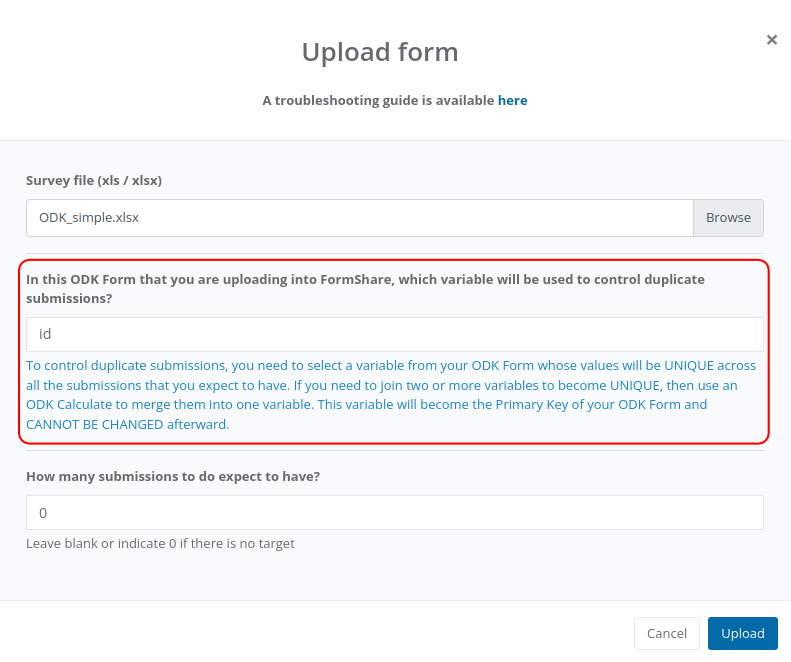

# Common errors in a form

FormShare manages your data in a better way but by doing so it performs more checks on your ODK Form. Though FormShare follows ODK's official standards it has more restrictions, for example, if you have an ODK form with a variable called "repeat" it will not upload in FormShare nor in Kobo because "repeat" is an ODK restricted word, however, if you have a variable called "abstract" the ODK form will upload in Kobo but not in FormShare because "abstract" is a restricted word in FormShare. **For this reason, if you have an ODK Form that works on other platforms it might need some modifications to work with FormShare**. The platform will inform you about the error and how to correct it.

This section provides information about the common errors in a form

## The primary key does not exist

> Message from FromShare: "The primary key variable does not exist or is inside a repeat."

When you upload a form FormShare asks you to indicate a variable to use to control duplicate submissions:

<figure><figcaption></figcaption></figure>

The variable to control duplicate submissions must exist in your form and it must be OUTSIDE a repeat.


**What is duplicate data?**

_Let’s imagine that you are surveying cattle in a rural village and each animal has an ear tag. Two enumerators, James and Patricia go around the village gathering the information for each animal. James and Patricia without realizing it, survey the same animal (the same ear tag) and send the data. To solve this problem and prevent having the same animal twice in our dataset, you can tell FormShare that the ear-tag variable **must be unique**. In this example, the **ear tag is the variable that you will use to control duplicated data**. FormShare will alert you that there is duplicated data, and you will be able to correct it easily._


To fix this problem, select a different variable or move the variable that you want to use outside any "repeat".

## Duplicated variables

> Message from FromShare: The following variables are duplicated within repeats or outside repeats

The ODK standard allows having two or more variables with the same name as long as they are in different groups. FormShare does not allow that and will tell you which variables are repeated. Just rename the variables to fix the problem.

## Variables with invalid names

> Message from FromShare: The following variables have invalid names

This error occurs when you have a variable that is also a restricted word in FormShare. The following is a list of restricted words that you CANNOT USE as variables or repeat names.



FormShare will tell you which variables have invalid names. Fix the problem by renaming the variables.

## Identical choices 

> Message from FromShare: The following choices are identical.

This error happens when two or more lists in the "Choices" sheet have the same options/items. The example below has the problem, the list sex\__owner is identical to the list sex\__pet.



To fix this error you need to use only one list. The error above can be solved by having only one list called "sex" and use it for both variables. See example:



## Mixing coded and not coded languages 

> Message from FromShare: This ODK form mixes coded and not coded languages. For example label::English (en) and label::Español. You need to code all the labels that are marked for translation.

FormShare is able to store the description of variables and options in multiple languages. The [ODK standard for translating an ODK](https://docs.getodk.org/form-language/) has evolved over time. In the beginning, the translation of an ODK was done using, for example, label::Español. Currently, it is done by adding the [ISO 639-1 code](https://en.wikipedia.org/wiki/List\_of\_ISO\_639-1\_codes), for example, label::Español (es).


Please note that you need to have a space between the description of the language and its code. The standard is label::<mark style="color:blue;">\[Language description]</mark><mark style="color:red;">\[space]</mark><mark style="color:green;">(</mark><mark style="color:blue;">\[language code]</mark><mark style="color:green;">)</mark>


In FormShare you cannot mix coded and not coded languages. To fix this problem you need to code all the labels that are marked for translation, for example, change label::Español to label::Español (es)

## The variable to control duplicate submissions has an invalid type 

> Message from FromShare: The variable to control duplicate submissions has an invalid type. For example, this variable cannot be note, picture, video, sound, select\_multiple, or geospatial. The most appropriate types are text, datetime, barcode, calculate, select\_one, or integer.

When you upload a form FormShare asks you to indicate a variable to use to control duplicate submissions:

<figure><figcaption></figcaption></figure>

The variable to control duplicate submissions cannot be a note, picture, video, sound, select\_multiple, or any variable of the geospatial type.


**What is duplicate data?**

_Let’s imagine that you are surveying cattle in a rural village and each animal has an ear tag. Two enumerators, James and Patricia go around the village gathering the information for each animal. James and Patricia without realizing it, survey the same animal (the same ear tag) and send the data. To solve this problem and prevent having the same animal twice in our dataset, you can tell FormShare that the ear-tag variable **must be unique**. In this example, the **ear tag is the variable that you will use to control duplicated data**. FormShare will alert you that there is duplicated data, and you will be able to correct it easily._


To fix this problem, select a different variable to control duplicate data.

## Tables with a name longer than 64 characters 

> Message from FromShare: FormShare needs you to shorten the name of some of your tables. The following tables have a name longer than 64 characters...

FormShare stores submissions as relational data. This means that it creates tables with columns in a database to store your data as rows. There is a whole section in this documentation to explain [how does FormShare stores your data](../repositories/how-does-formshare-stores-my-data.md), however, to explain this error it is important to understand  when FormShare creates tables. FormShare creates tables in these three circumstances:

1. A table called "maintable" is created to store all variables that are outside any "repeat" structure.
2. Every "repeat" structure creates a table. The name of the table will be the name of the repeat.
3. Every variable of type "selectˍmultiple" or "rank" create a table to store each selection or each rank as independent rows. The name of the table will be <mark style="color:blue;">\[parentˍtable]</mark><mark style="color:red;">ˍmselˍ</mark><mark style="color:green;">\[variableˍname]</mark>. For example:

* A "selectˍmultiple" variable named "gender" outside any repeat will create the table called "<mark style="color:blue;">maintable</mark><mark style="color:red;">ˍmselˍ</mark><mark style="color:green;">gender</mark>".&#x20;
* A "selectˍmultiple" variable named "livestock" inside a repeat named "livestock\_repeat" will create a table called "<mark style="color:blue;">livestockˍrepeat</mark><mark style="color:red;">ˍmselˍ</mark><mark style="color:green;">livestock</mark>".

FormShare uses [MySQL](https://en.wikipedia.org/wiki/MySQL) to store submissions as relational data and MySQL restricts the name of tables to a maximum of 64 characters. This error indicates that one or more tables have a name with more than 64 characters. There are different ways that the error may happen:



To correct this error you need to rename the name of the variables.


It would be best to use short names for your variables. FormShare has a data dictionary and you will be able to work with variable descriptions.


## CSV files with invalid characters in column headers 

> Message from FromShare: The following CSV files have invalid characters in column headers

FormShare can read external CSV files and import their contents into the database. For example, FormShare will read the CSV file of variables like "selectˍoneˍfromˍfile" or "selectˍmultipleˍfromˍfile" and load the options into the database. The column headers must NOT contain any special characters like spaces or commas. Underscore (\_) is the only character that is allowed in column headers.

Fix this problem by replacing spaces with underscores and removing any other characters.

## CSV files with an invalid structure 

> Message from FormShare: The following files have an invalid structure.

FormShare can read external CSV files and import their contents into the database. For example, FormShare will read the CSV file of variables like "selectˍoneˍfromˍfile" or "selectˍmultipleˍfromˍfile" and load the options into the database. This error happens when the CSV is corrupted, for example, when the file has 4 headers separated by a comma but a row has 5 values separated by a comma.

Fix this problem by checking the file in a CSV reader like MS Excel.

## Choice  list with duplicate option 

> Message from FormShare: The following options are duplicated in the ODK you just submitted

In an ODK you can have cascading choices with repeated options by marking the "allow\_choice\_duplicates" setting as true. However, FormShare does not allow duplicate options.
