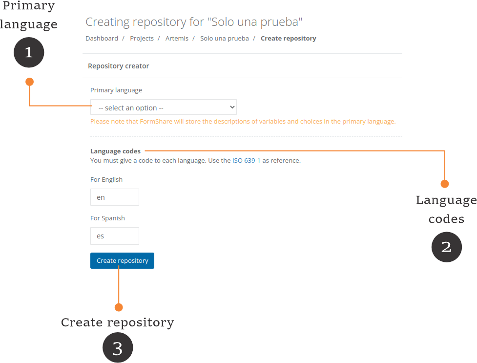

# Forms with multiple languages

When you create an ODK Form it is possible to localize labels, hints, and messages in different languages. Localization is performed by adding "::<mark style="color:blue;">**language\_name**</mark> (<mark style="color:green;">**language\_code**</mark>)" to labels, hints, and messages. For example, you can have "label::<mark style="color:blue;">**Español**</mark> (<mark style="color:green;">**es**</mark>) and label::<mark style="color:blue;">**Français**</mark> (<mark style="color:green;">**fr**</mark>)" to indicate labels in Spanish and French.

For each ODK form that you upload into FormShare, the system can create a repository to hold its submissions. This repository also stores a data dictionary where each variable in your ODK has its corresponding label and each item of an option list has its corresponding description. This means that FormShare stores the variable and option labels in the database. Therefore if you have an ODK localized for different languages, you would need to tell FormShare some information about the languages.

The process of creating a repository starts in the same way regardless of the localization of a form.

1. If you have testing data you can automatically import it into the repository (default) however, you can discard/delete all testing data.
2. To create the repository click on the "Create repository" button. If the form has been localized in different languages then FormShare will ask you to provide more details.

<figure><figcaption></figcaption></figure>

1. **Primary language**: You need to select a primary language for your repository. For example, if your ODK is localized in English and Español then you need to indicate what language will FormShare use to store options and variable names. **Choosing the right language matters!** If you select Español then the dictionary will have the variable names in Spanish and all exports with option labels will also be in Spanish. <mark style="color:red;">**You cannot change the language of a repository once it has been generated.**</mark>
2. **Language codes**: No need to provide a language code for each language. If you followed the standard on how to localize an ODK by using "::<mark style="color:blue;">**language\_name**</mark> (<mark style="color:green;">**language\_code**</mark>)" then FormShare will extract the language code. If you don't qualify all your languages ODK for example, by having "<mark style="color:red;">label</mark> and label::<mark style="color:blue;">**Español**</mark> (<mark style="color:green;">**es**</mark>)" then you will need to indicate the code for the uncoded label. Each language code has two digits. You can see the full list of language codes on this [Wikipedia page](https://en.wikipedia.org/wiki/List\_of\_ISO\_639-1\_codes).
3. **Create repository**: Once you indicated all language parameters, press the "Create Repository" button to create the repository for your form.
