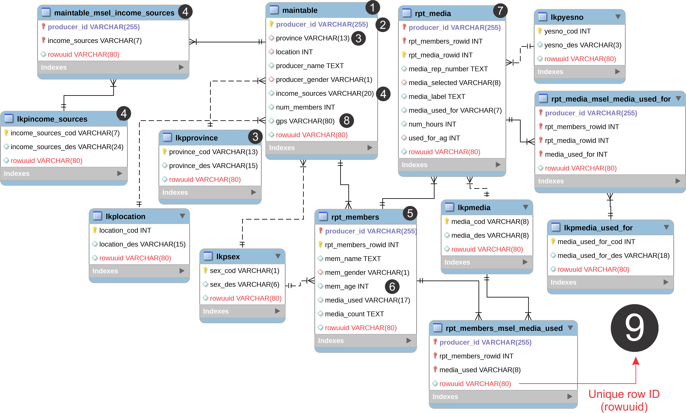
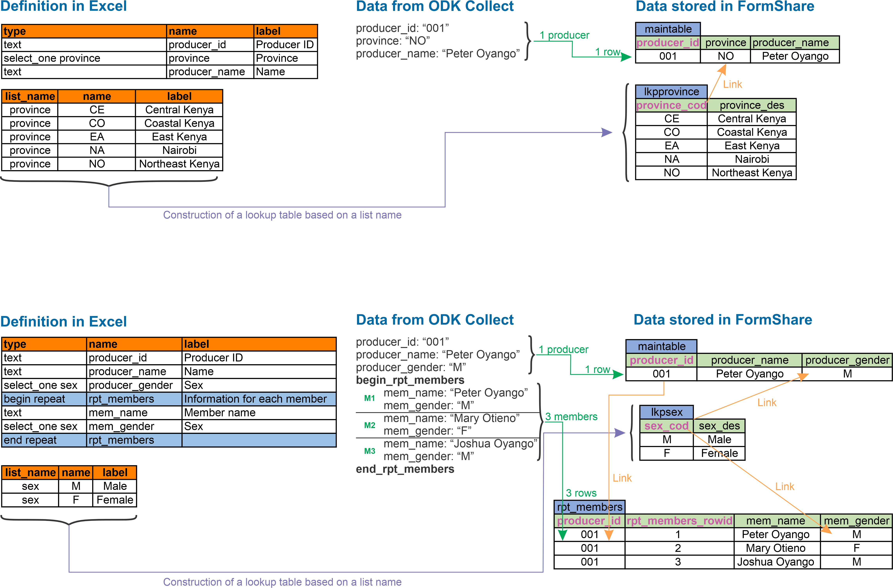

# How does FormShare stores my data?

## What is relational data?

One of the main differences in terms of data management between FormShare and the rest of the applications in the market is that FormShare stores your submissions as relational data in a relational database. A relational database is a collection of data items with pre-defined relationships between them. These items are organized as a set of tables with columns and rows. Tables are used to hold information about the submissions to be represented in the database.&#x20;

Let's use a household survey as an example. Our database might have a table containing household information, with columns representing variables like the name or the gender of the head of the household, while each row contains data for each household. These tables can be linked using keys. If we collect information about each crop grown by a household, the database might have a table containing crops information, with columns representing variables like crops name, total amount sold, and market value, while each row contains data for one individual crop but each of them connected to one household in the household table using the household ID as a key to link them.&#x20;

One of the main advantages of storing data this way is that complex queries can be performed on the data using SQL language. For example, you can calculate the total income per crop per household:

```sql
SELECT household_id, crop_name, SUM(total_sold x market_value) AS income
FROM table_crops GROUP BY household_id,crop_name;
```

The SQL query would return a table like this:

| household\_id | crop\_name | income   |
| ------------- | ---------- | -------- |
| 001           | Maize      | 16720.58 |
| 001           | Beans      | 7570.34  |
| 002           | Maize      | 21836.45 |
| 002           | Sorghum    | 32567.20 |

Other advantages are:

* Duplicate keys are blocked from entering the database. For example, it cannot be two households with ID 001 in the database.
* Data cleaning gets automatic checks. For example, a data cleaning technician cannot change a crop to a name that does not exist in the table of possible crops.
* Data cleaning is audited no matter the tool used. For example, a data cleaning technician could use R, STATA, Excel, or the web interface to change the market value of Maize and the database will record the name of the technician making the change along with the date and time, previous value and new value.

FormShare is <mark style="color:red;">**the only**</mark> data management system for ODK in the market that stores submissions relationally in a relational database.

## How does FormShare stores my data? One ODK form = One database

For each ODK form that you upload into FormShare, the system creates a database to hold its submissions. This database is called a “repository”. At first, forms are uploaded in a “testing” stage (without a repository) but then you can create a repository for them to store “real” data. The reason for a testing stage is that it is easier to replace a form without a repository because FormShare does not need to alter the underlying database, however it is possible to merge new versions of a form into a common repository.

Let’s explore the below ODK Form:

<figure><figcaption></figcaption></figure>

The ODK has single and multiple selects and two repeats (one nested inside another). If you upload the form, FormShare will ask you to indicate which variable will be used to control duplicate data. In this example such variable is "producer\_id" and therefore it will be the <mark style="color:purple;">**Primary key**</mark> of the repository.

FormShare will generate the following repository from the above ODK form:


The numbers between the image above and the image below match to indicate how FormShare created the repository based on the structure of the ODK form.


<figure><figcaption></figcaption></figure>

## A repository in detail


Each number of the above images is explained in detail.


<mark style="color:red;">**1.**</mark> **Variables outside repeats:** They are stored in a data table called “maintable”. This is the primary table of the repository.

<mark style="color:red;">**2.**</mark> **Primary key:** To control duplicate submissions the repository needs a <mark style="color:purple;">**primary key**</mark>. When uploading a form you need to select a variable that its data will not duplicate across the whole sample that you expect to have. For example, <mark style="color:purple;">**producer\_id**</mark>.

<mark style="color:red;">**3.**</mark> **Single selects:** Single selects whether their options come from external files or not creates a lookup table. The lookup table will be called “lkp\_<mark style="color:blue;">**\[listname]**</mark>”. For example, if you have “select\_one province” FormShare will create the lookup table called “lkp\_<mark style="color:blue;">**province**</mark>”.

Each lookup table has two columns: “<mark style="color:blue;">**\[listname]**</mark>\_cod” storing option names/codes and “<mark style="color:blue;">**\[listname]**</mark>\_des” storing option labels/descriptions. For example, the lookup table “lkp\_province” will have the following columns: “<mark style="color:blue;">**province**</mark>\_cod” and “<mark style="color:blue;">**province**</mark>\_des”.

The lookup table will store all the options and will be linked to the data table using that list name. For example, the column “province” in “maintable” will be linked to the lookup table “lkp\_province” using “province\_cod”.

The data tables storing the submission data will save the option name/code while the label/description of the option will always reside in the lookup table. The <mark style="color:purple;">**primary key**</mark> of all lookup tables is the “<mark style="color:blue;">**\[listname]**</mark>\_cod” column. For example, the <mark style="color:purple;">**primary key**</mark> of “lkp\_provice” is “<mark style="color:purple;">**province\_cod**</mark>”.

The below image explains how single selects are stored and linked:

<figure><figcaption></figcaption></figure>

<mark style="color:red;">**4.**</mark> **Select multiple:** ODK Collect stores “select multiple” variables in one field with selected options separated by space. FormShare stores it as independent rows in a separate table linked to the data table using such multi-select and to the associated lookup table.

The image below explain how select multiples are stored and linked:

<figure><figcaption></figcaption></figure>

Each multi-select table is named in the following way: “<mark style="color:blue;">**\[data-table-with-the-multiselect]**</mark>\_msel_\__<mark style="color:blue;">**\[multiselect-variable]**</mark>”. For example, the multi-select variable called “income\_sources” is outside any repeat therefore it will be stored in “maintable” thus the multi-select table storing the options as independent rows will be called “<mark style="color:blue;">**maintable**</mark>\_msel\_<mark style="color:blue;">**income\_sources**</mark>”.

The <mark style="color:purple;">**primary key**</mark> of a multi-select table will be the combination of its parent’s <mark style="color:purple;">**primary key**</mark> plus and the multi-select variable. For example, the <mark style="color:purple;">**primary key**</mark> of “maintable\_msel\_income\_sources” is “<mark style="color:purple;">**producer\_id**</mark>” + “<mark style="color:purple;">**income\_sources**</mark>”.

<mark style="color:red;">**5.**</mark> **Repeats:** Repeats create data tables. The name of the data table is the same as the repeat. For example, the repeat “rpt\_members” will create the table “rpt\_members”.

Repeats at the same level of variables outside a repeat will become “child data tables” of “maintable”. For example, “rpt\_members” is a child table of “maintable”.

The <mark style="color:purple;">**primary key**</mark> of a repeat data table will be the combination of its parent’s <mark style="color:purple;">**primary key**</mark> plus a sequence column called “<mark style="color:blue;">**\[repeat\_name]**</mark>\_rowid”. For example, the <mark style="color:purple;">**primary key**</mark> of “rpt\_members” is “<mark style="color:purple;">**producer\_id**</mark>” + “<mark style="color:purple;">**rpt\_members\_rowid**</mark>”. The sequence will start in 1 and increment for every row.

The image below explain repeats are stored and linked:

<figure><figcaption></figcaption></figure>

<mark style="color:red;">**6.**</mark> **Variables inside repeats**: Because repeats create data tables, all the variables contained by the repeat will be part of that data table.

<mark style="color:red;">**7.**</mark> **Nested repeats:** Repeats inside another repeat will become “child data tables” of its parent repeat. For example, “rpt\_media” is a child table of “rpt\_members”.

The <mark style="color:purple;">**primary key**</mark> of a nested repeat data table will be the combination of its parent’s <mark style="color:purple;">**primary key**</mark> plus a sequence column called “<mark style="color:blue;">**\[repeat\_name]**</mark>\_rowid”. For example, the <mark style="color:purple;">**primary key**</mark> of “rpt\_members” is “<mark style="color:purple;">**producer\_id**</mark>” + “<mark style="color:purple;">**rpt\_members\_rowid**</mark>” therefore the <mark style="color:purple;">**primary key**</mark> of “rpt\_media” is “<mark style="color:purple;">**producer\_id**</mark>” + “<mark style="color:purple;">**rpt\_members\_rowid**</mark>” + “<mark style="color:purple;">**rpt\_media\_rowid**</mark>” The sequence will start in 1 and increment for every row.

The image below explains how nested repeats are stored and linked:

<figure><figcaption></figcaption></figure>

<mark style="color:red;">**8.**</mark> **Geopoint outside a repeat:** If you record the GPS position as part of your data, place the “geopoint” variable outside any repeat. FormShare will detect it and use it to display your submissions on a map and to generate products like KLM.

<mark style="color:red;">**9.**</mark> **Unique row ID (rowuuid):** This is perhaps the most important feature in a FormShare repository. Each row of data in any table (data, lookup, or multi-select) in any repository has a unique row ID. This unique ID allows FormShare to identify a row in the system and to determine the associated form, repository, and table. The unique Row ID is commonly used in API data cleaning to update data in the repository.

