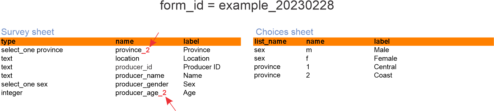

# Merging subversions of a form

## How does the process of merging work?

For each ODK form you upload into FormShare, the system can create a repository to hold its submissions. The repository matches the structure of a form. See, for example, the image below.

<figure><figcaption></figcaption></figure>

The table that stores submissions matches the structure of the survey. In this version of the survey, we have the variable "producer\_age" as categorical, "province" as text, and we have a typo in the label for the option "f" in list\_name "sex."

A new survey version fixes the typo but also changes "producer\_age" to a continuous variable and "province" to a select\_one. See below.

<figure><figcaption></figcaption></figure>

Since FormShare creates a repository that matches the structure of a form, any new version of a form must store the submissions in the repository of its first version. This process is called "Merging." FormShare merges the **incremental changes** made on a form by adapting the repository to store such changes.


Incremental changes mean changes that modify or add new variables to the repository. For example, if in a new version of the above form, the variable "producer\_name" is removed, then the process of merging **WILL NOT** remove the column "producer\_name" from the repository.


The process of merging a new version of a form has several rules to ensure data consistency across versions:

1. The primary key of a repository cannot change type.
2. A variable cannot change from categorial (select\_one or select\_multiple) to continuous (text, integer, decimal) and vice versa.
3. A text variable cannot change into any other kind of variable.
4. Single selects cannot change into multiple selects and vice versa.
5. Decimal variables cannot change into integer variables.
6. A repeat cannot change a parent. For example, the repeat of crops was inside the repeat of plots in version 1, but in version 2, the repeat of crops is inside the repeat of seasons inside the repeat of plots.
7. Lookup labels can change across versions, but <mark style="color:red;">**you take the risk**</mark>. The above example corrected the typo to read "Female," but nothing stop you from indicating "f" = "Male" and "m" = "Female". FormShare will alert you of these changes, **but it is up to you to continue merging the new version**.

FormShare would not be able to merge the version in the example above because the variable "province" changed from text to select\_one and the variable "producer\_age" changed from select\_one to integer. The structure of the form would need to change before merging. For example:

<figure><figcaption></figcaption></figure>

FormShare will be able to merge the form by changing the name of the variables (adding a \_2) because such variables do not exist in the previous version. After merging the submissions from form "example\_20230225" store data in "province" and "producer\_age" while those coming from form "example\_20230228" store data in "provice\_2" and "producer\_age\_2". See below:


Example of merged data. In yellow coming from form "example\_20230225" and in green from form "example\_20230228"


It will be through [data cleaning](../../data-management/for-designers/figma-integration/) to have both data in one coherent set.

## Merging a new version

Some content here
