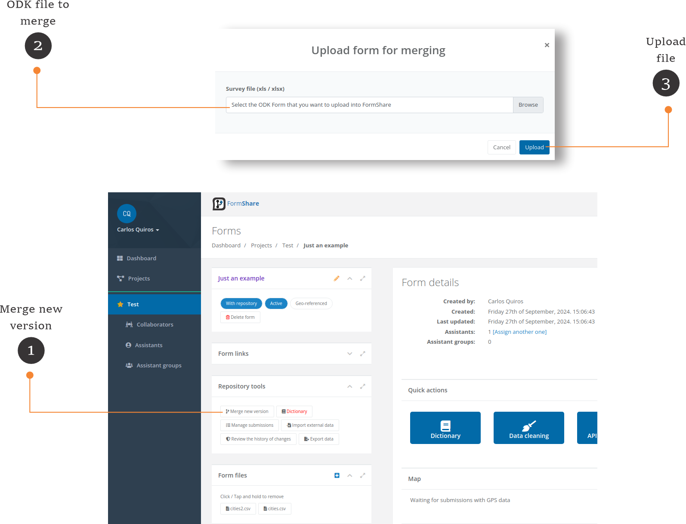

# Merging subversions of a form

## How does the process of merging work?

For each ODK form you upload into FormShare, the system can create a repository to hold its submissions. The repository's structure matches that of the form. See, for example, the image below.

<figure><figcaption></figcaption></figure>

The table that stores submissions matches the structure of the survey. In this version of the survey, we have the variable "producer\_age" as categorical, "province" as text, and we have a typo in the label for the option "f" in list\_name "sex."

A new survey version fixes the typo but also changes "producer\_age" to a continuous variable and "province" to a select\_one. See below.

<figure><figcaption></figcaption></figure>

Since FormShare creates a repository that matches the structure of a form, any new version of a form must store the submissions in the repository of its first version. This process is called "Merging." FormShare merges the **incremental changes** made on a form by adapting the repository to store such changes.


Incremental changes mean changes that modify or add new variables to the repository. For example, if the variable "producer\_name" is removed from a new version of the above form, then the merging process **WILL NOT** remove the column "producer\_name" from the repository.


The process of merging a new version of a form has several rules to ensure data consistency across versions:

1. The primary key of a repository cannot change type.
2. A variable cannot change from categorial (select\_one or select\_multiple) to continuous (text, integer, decimal) and vice versa.
3. A text variable cannot change into any other kind of variable.
4. Single selects cannot change into multiple selects and vice versa.
5. Decimal variables cannot change into integer variables.
6. A repeat cannot change a parent. For example, in version 1, the repeat of crops was inside the repeat of plots, but in version 2, the repeat of crops is inside the repeat of seasons inside the repeat of plots.
7. Lookup labels can change across versions, but <mark style="color:red;">**you take the risk**</mark>. The above example corrected the typo to read "Female," but nothing stop you from indicating "f" = "Male" and "m" = "Female". FormShare will alert you of these changes, **but it is up to you to continue merging the new version**.

FormShare could not merge the version in the example above because the variable "province" changed from text to select\_one, and the variable "producer\_age" changed from select\_one to integer. The structure of the form would need to change before merging. For example:

<figure><figcaption></figcaption></figure>

FormShare will be able to merge the form by changing the name of the variables (adding a \_2) because such variables do not exist in the previous version. After merging the submissions from form "example\_20230225" store data in "province" and "producer\_age" while those coming from form "example\_20230228" store data in "provice\_2" and "producer\_age\_2". See below:


Example of merged data. In yellow coming from form "example\_20230225" and in green from form "example\_20230228"


It will be through data cleaning to have both data in one coherent set.

## Upload a new version.

To merge a new version of a form, go to the "Form Details" page **of the latest version**.

<figure><figcaption></figcaption></figure>

1. Merge new version: Click the "Merge new version" button. A sub-window will appear, allowing you to upload the latest version of the ODK form.
2. ODK file to merge: Browse the ODK form file you want to merge.
3. Upload file: Click the "Upload" button to upload the file. FormShare will check the file, and **the new form will start at the testing stage**. FormShare will take you to the "Form Details" page of the latest version. You need to assign assistants to the new form. Attach any CSV file required by the new form.


We have noticed that 90% of users do not test their forms before generating a repository. Even though FormShare allows merging different versions of a form into one common repository, making changes to a form is more straightforward when it is in the testing stage.

**Why do I need to test my form?**

Though FormShare checks for specific errors in your form, it does not check:

* Logic problems. For example, if a question is not asked due to a wrong condition.
* Missing a question is common, and a field test can spot such problems.
* Field agents might not understand the survey, so more notes are required.


## Merge the new version.

<figure><figcaption></figcaption></figure>

1. Merge repository: After testing the form, click the "Merge repository" button or the "Merge into the repository of ..." link to merge the form. The "Merge form" page will appear.

<figure><figcaption></figcaption></figure>

1. Important notes: Read these important notes. At this stage, FormShare will have tested your form to ensure it can be merged. However, if you have modifications in "choice lists" (as noted in point 7 [above](merging-subversions-of-a-form.md#how-does-the-process-of-merging-work)), FormShare will ask you again to proceed with merging those changes.
2. Discard testing data: Toggle this switch to discard any testing data.
3. Merge new version: Click the "Merge new version" button to merge the form into the repository. FormShare will show you the progress.

<figure><figcaption></figcaption></figure>

After the merging process is complete, FormShare will show the details of the form.

<figure><figcaption></figcaption></figure>
