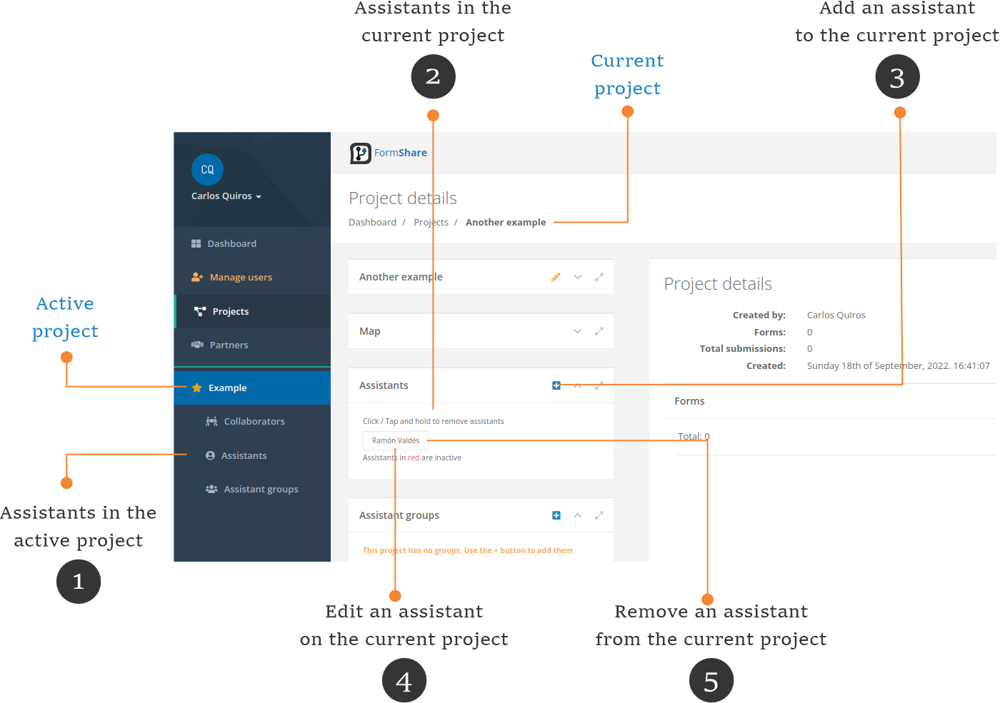

# Assistants


**Active project vs current project**

* In FormShare you can have one active project. The active project is marked with a star (⭐) and is the one showing on the [Dashboard](the-dashboard.md).
* The current project is the one displayed on the screen. This can be any project that you select including the active project.


## Assistants

Assistants help you collect and clean data. Assistants are created under a project (they belong to a project) but they can assist in several forms in different capacities across projects.

<figure><figcaption></figcaption></figure>

1. **Assistants in the active project**: Click on the "Assistants" link to access the list of assistants in the active project.
2. **Assistants in the current project**: On the "Project Details" page the assistants are shown in the "Assistants" section.
3. **Add an assistant to the current project**: Click on the (+) button to add an assistant to the current project. The add assistant page will appear.
4. **Edit an assistant on the current project**: Click on any assistant to edit its details. The edit assistant page will appear.
5. **Remove an assistant from the current project**: Click and hold on any assistant to remove it from the current project.

### List of assistants

## Groups of assistants
