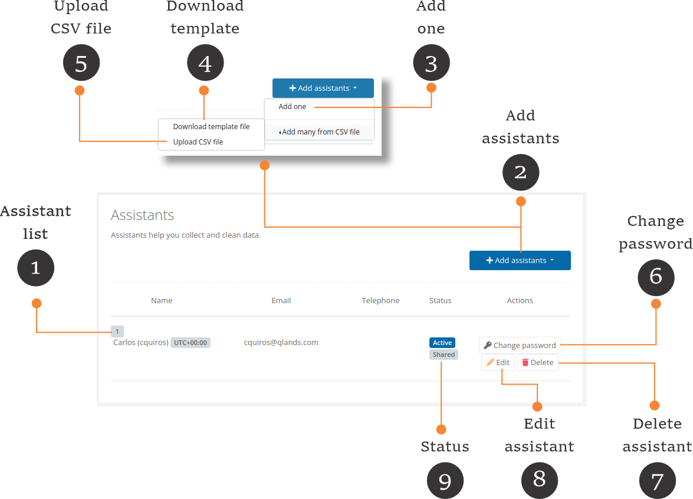

# Assistants


**Active project vs current project**

* In FormShare you can have one active project. The active project is marked with a star (⭐) and is the one showing on the [Dashboard](the-dashboard.md).
* The current project is the one displayed on the screen. This can be any project that you select including the active project.


## Assistants

Assistants help you collect and clean data. Assistants are created under a project (they belong to a project) but they can assist in several forms in different capacities across projects.

<figure><figcaption></figcaption></figure>

1. **Assistants in the active project**: Click on the "Assistants" link to access the list of assistants in the active project.
2. **Assistants in the current project**: On the "Project Details" page the assistants are shown in the "Assistants" section.
3. **Add an assistant to the current project**: Click on the (+) button to add an assistant to the current project. The add assistant page will appear.
4. **Edit an assistant on the current project**: Click on any assistant to edit its details. The edit assistant page will appear.
5. **Remove an assistant from the current project**: Click and hold on any assistant to remove it from the current project.

### List of assistants

<figure><figcaption></figcaption></figure>

1. **Assistant list:** This list shows the assistants created under the selected project.
2. **Add assistants:** Click the "Add assistants" button to add new assistants. You can add assistants individually or upload a CSV file with several assistants.
3. **Add one:** Click the "Add one" button to add one assistant. The assistant form will appear.
4. **Template file:** Click on the "Download template file" to obtain an example CSV file to help you set each assistant's information.
5. **Upload:** Click the "Upload CSV file" button to upload the assistants from the CSV file. FormShare will upload all or none. If you have an error uploading the file, none of the assistants will be uploaded.  FormShare will tell you the error in your CSV file.
6. **Change password:** Click the "Change password" button to set a new password for the assistant. The assistant can also change its password after logging in on the Assistance Access portal.
7. **Delete assistant:** Click the "Delete" button to delete the assistant. FormShare will ask you if you are sure that you want to delete the assistant.
8. **Edit assistant:** Click the "Edit" button to edit the assistant's details.
9. **Status:** The status shows whether the assistant is active or not. Inactive assistants cannot collect or clean data. You can use assistants that have this badge across projects within your account.

### Add assistants individually

Click the "Add one" button to add one assistant. The assistant form will appear.

## Groups of assistants
