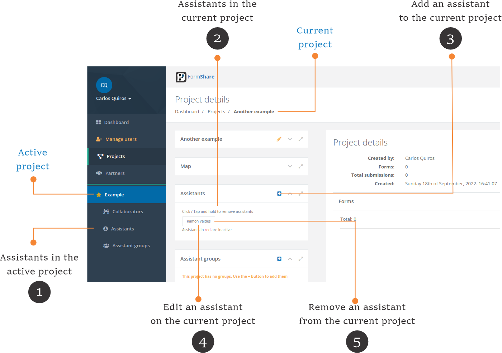
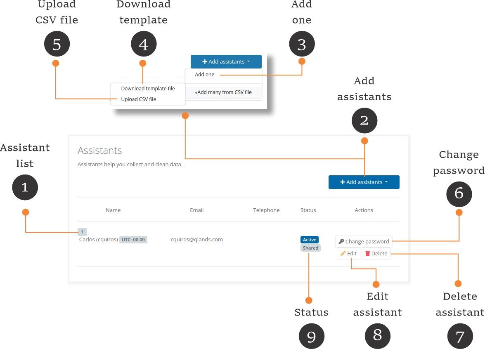

# Assistants


**Active project vs. current project**

* In FormShare, you can have one active project. The active project is marked with a star (⭐) and is the one showing on the [Dashboard](../the-dashboard.md).
* The current project is displayed on the screen. It can be any project you select, including the active project.


Assistants help you collect and clean data. Assistants are created under a project (they belong to a project) but can assist in several forms and different capacities across projects.

<figure><figcaption></figcaption></figure>

1. **Assistants in the active project**: Click on the "Assistants" link to access the list of assistants in the active project.
2. **Assistants in the current project**: On the "Project Details" page the assistants are shown in the "Assistants" section.
3. **Add an assistant to the current project**: Click on the (+) button to add an assistant to the current project. The add assistant page will appear.
4. **Edit an assistant on the current project**: Click on any assistant to edit its details. The edit assistant page will appear.
5. **Remove an assistant from the current project**: Click and hold on any assistant to remove it from the current project.

### List of assistants

<figure><figcaption></figcaption></figure>

1. **Assistant list:** This list shows the assistants created under the selected project.
2. **Add assistants:** Click the "Add assistants" button to add new assistants. You can add assistants individually or upload a CSV file with several assistants.
3. **Add one:** Click the "Add one" button to add one assistant. The assistant form will appear.
4. **Template file:** Click on the "Download template file" to obtain an example CSV file to help you set each assistant's information.
5. **Upload:** Click the "Upload CSV file" button to upload the assistants from the CSV file. FormShare will upload all or none. If you have an error uploading the file, none of the assistants will be uploaded.  FormShare will tell you the error in your CSV file.
6. **Change password:** Click the "Change password" button to set a new password for the assistant. The assistant can also change its password after logging in on the Assistance Access portal.
7. **Delete assistant:** Click the "Delete" button to delete the assistant. FormShare will ask you if you are sure that you want to delete the assistant.
8. **Edit assistant:** Click the "Edit" button to edit the assistant's details.
9. **Status:** The status shows whether the assistant is active or not. Inactive assistants cannot collect or clean data. You can use assistants that have this badge across projects within your account.

### Add assistants individually

Click the "Add one" button on the assistant list page to add one assistant. The assistant form will appear.

<figure><figcaption></figcaption></figure>

* Assistant ID: This is a simple name to identify the assistant in FormShare. It is the name that the assistant will use in ODK Collect. The assistant ID must be unique across your account and cannot be changed afterward.
* Full name: Indicate the name of the assistant here.
* Email: Indicate the assistant's email here. Two assistants cannot have the same email within your account.
* Time zone: This is where the assistant performs their activities.
* Telephone: This is optional.
* Password and Password confirmation: Indicate here the password of the assistant account. This will be used in ODK Collect to authenticate the assistant.
* Share among projects: If selected (green), this person can assist with different projects within your account.

Click the "Add assistant" button to add the assistant. FormShare will take you to the assistant list or redirect you to where you were before.

### Edit an assistant

Click the "Edit assistant" button on the assistant list page to modify an assistant's details. The page has two sections: Current Information and Change Password.

#### Current information

<figure><figcaption></figcaption></figure>

* Assistant ID: This shows the assistant's ID. It cannot be changed.
* Full name: Indicate the name of the assistant here.
* Email: Indicate the assistant's email here. Two assistants cannot have the same email within your account.
* Time zone: This is where the assistant performs their activities.
* Telephone: This is optional.
* Share among projects: If selected (green), this person can assist with different projects within your account.
* API Key: This key helps an assistant perform actions in FormShare through the Application Program Interface (API). For example, an assistant can perform data cleaning operations using third-party software like R or Stata. Press the "Generate new key" button on the far right of this field to create a new key for the assistant.
* Active: An active assistant can perform data collection or data cleaning tasks. Move this switch to the left (red) to deactivate an assistant.

Click the "Modify assistant" button to save the changes.

#### Change password

<figure><figcaption></figcaption></figure>

* Password and confirmation: Indicate a new password for the assistant here.

Click the "Change password" button to modify the assistant's password. This will not save any changes made in the "Current information" section.

### Delete an assistant

Click the "Delete" button on the assistant list page to remove an assistant from your account. Please note that you cannot remove an assistant that has collected or cleaned data. Deactivate the assistant instead.
