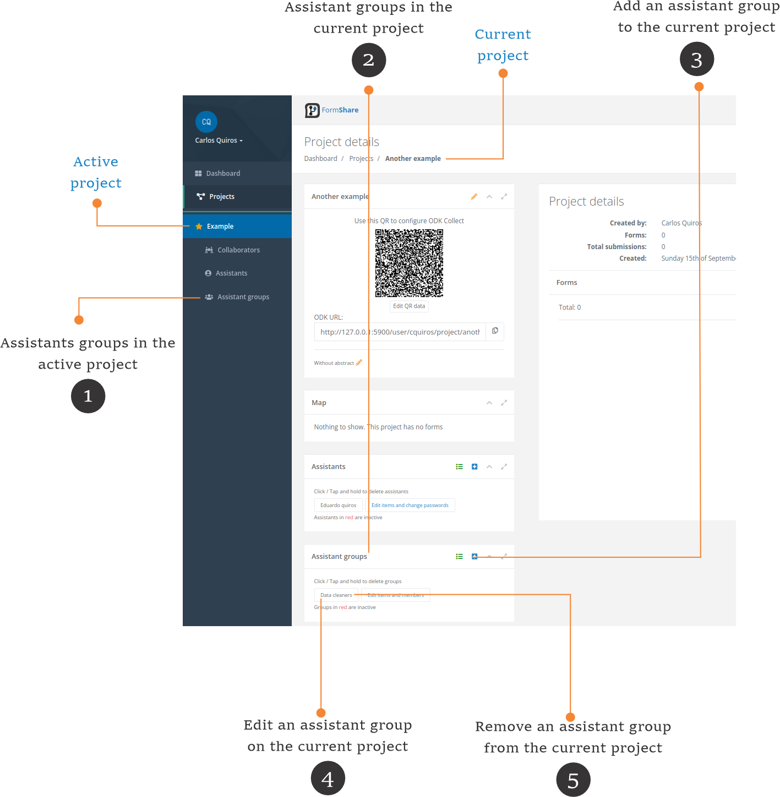

# Assistant groups



**Active project vs. current project**

* In FormShare, you can have one active project. The active project is marked with a star (⭐) and is the one showing on the [Dashboard](../the-dashboard.md).
* The current project is displayed on the screen. It can be any project you select, including the active project.


Assistant groups help you organize assistants in groups. For example, you can have a data cleaners group and assign it to a form with data cleaning privileges. All the assistants of that group will be able to clean data.

<figure><figcaption></figcaption></figure>

1. **Assistant groups in the active project**: Click on the "Assistants groups" link to access the list of assistant groups in the active project.
2. **Assistants in the current project**: The assistant groups are shown in the "Assistant groups" section on the "Project Details" page.
3. **Add an assistant group to the current project**: Click on the (+) button to add an associate group to the current project. The add assistant group page will appear.
4. **Edit an assistant on the current project**: Click on any assistant group to edit its details. The edit assistant group\[ page will appear.
5. **Remove an assistant from the current project**: Click and hold on any assistant group to remove it from the current project.
