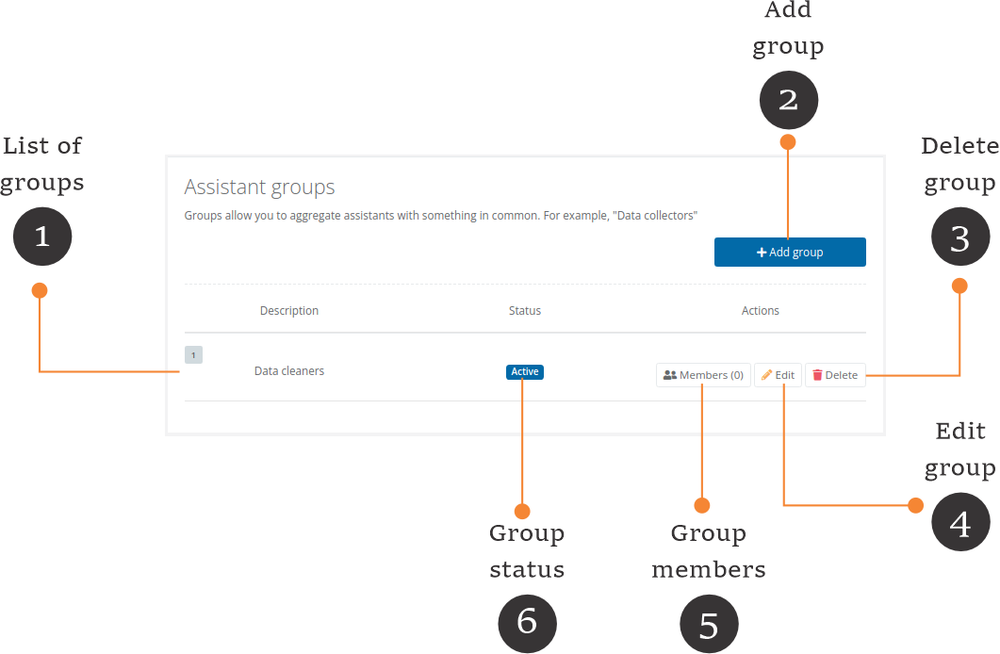
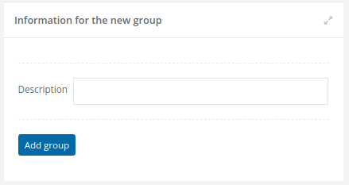
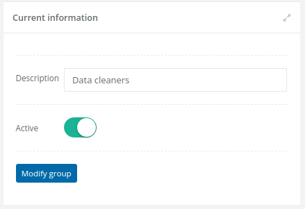
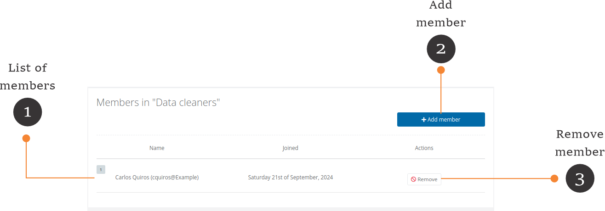
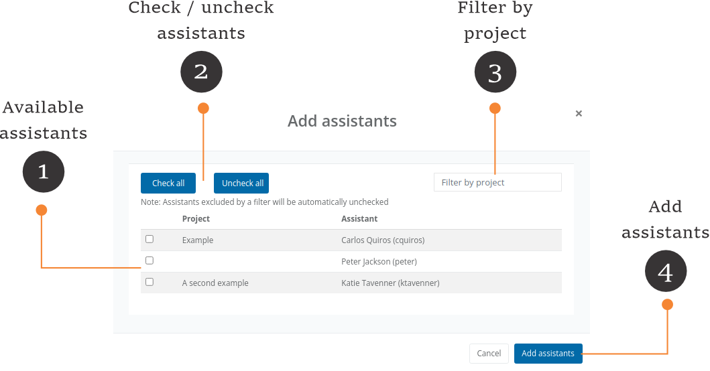

# Assistant groups



**Active project vs. current project**

* In FormShare, you can have one active project. The active project is marked with a star (⭐) and is the one showing on the [Dashboard](../the-dashboard.md).
* The current project is displayed on the screen. It can be any project you select, including the active project.


Assistant groups help you organize assistants in groups. For example, you can have a data cleaners group and assign it to a form with data cleaning privileges. All the assistants of that group will be able to clean data.

<figure><figcaption></figcaption></figure>

1. **Assistant groups in the active project**: Click on the "Assistants groups" link to access the list of assistant groups in the active project.
2. **Assistants groups in the current project**: The assistant groups are shown in the "Assistant groups" section on the "Project Details" page.
3. **Add an assistant group to the current project**: Click on the (+) button to add an associate group to the current project. The add assistant group page will appear.
4. **Edit an assistant group on the current project**: Click on any assistant group to edit its details. The edit assistant group\[ page will appear.
5. **Remove an assistant group from the current project**: Click and hold on any assistant group to remove it from the current project.

### List of assistant groups

<figure><figcaption></figcaption></figure>

1. **List of groups**: Each group will appear in this list.
2. **Add group**: Click the "Add group" button to add a new group.
3. **Delete group**: Click the "Delete" button to delete the group. This action will only delete the group but not its members.
4. **Edit group**: Click the "Edit" button to edit the group description.
5. **Group members**: This button shows the number of members in a group. Click on it to add or remove members.
6. **Group status**: The status of all the members in a group is shared. If a group is inactive, all its members cannot collect or clean data.

### Add new group

Click the "Add group" button to add a new group. The form for adding a group will appear.

<figure><figcaption></figcaption></figure>

* Description: Add the name of the group here.

Click the "Add group" button to add the group. FormShare will take you to the Group List page.

### Edit group

Click the "Edit button" to edit the group's description. The form for editing the group will appear.

<figure><figcaption></figcaption></figure>

* Description: Edit the description of the group here.
* Active: A group is active where the active switch is in green. Switch it to the right to inactivate the group.

Click the "Modify group" button to commit the changes. FormShare will take you to the Group List page.

### Group members

Click the "Members" button to add or remove members to the group. The list of members page will appear.

<figure><figcaption></figcaption></figure>

1. **List of members**: This list shows the group's members. Each member has a timestamp when it joins the group.
2. **Add member**: Click the "Add member" button to add an assistant to the group. The "Add assistants" screen will appear.
3. **Remove member**: Click the "Remove" button to remove an assistant from the group.

### Add members

Click the "Add member" button to add an assistant. The "Add assistants" screen will appear.

<figure><figcaption></figcaption></figure>

1. **Available assistants**: This list shows all the assistants across your account who can join a group. Each assistant is defined within a project; therefore, each assistant's project is shown here.&#x20;
2. **Check/uncheck assistants:** Use these two buttons to check/uncheck all the assistants in the list.
3. **Filter by project**: Type the project's name here to filter its assistants.
4. **Add assistants**: Click the "Add assistants" button to add the assistants to the group. Only checked assistants will be added. FormShare will take you to the "Members list" page.

### Remove Assistant

Click the "Remove" button to remove an assistant from the group.

