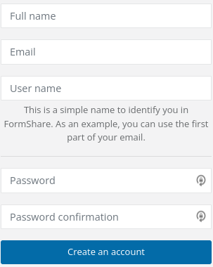
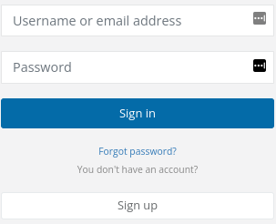

# Registering and logging in

### Registration


The "Sign up button" may not appear if you configure FormShare to not allow online registration. See the section "Post-install configuration" for more information.


To start using FormShare click on the "Sign up" button in the main menu.

The registration page will appear. You need to provide the following information:

* Full name: This is your full name as you wanted to appear in your profile
* Email: Your email address. FormShare can send you notifications or important messages by email.
* User name: This is a simple name to identify you in FormShare. This name does not allow any special characters including space. **It cannot be changed afterward**.
* Password and confirmation: This can be of any length > 0 with or without special characters.

Once the registration is completed, you will be able to create your first project.

### **Login**

If you log out from FormShare click on the "Sign in" button to login an again.

.png>)

The login page will appear. You need to provide the following information:

* User name/email address: Your can use either.
* Password: Your secure password. If you forget your password you can request a password reset.

### Change my password

To request a password request click on the "Forgot password" link on the login page

The reset password will appear. You need to indicate your email. FormShare will send you instructions on how to change your password. FormShare then will take you to the download page. **FormShare does not tell you whether an email exists to avoid malicious email discovery**.

The email with instructions for changing your password comes with a password reset token. You have 24 hours to change your password. Click on the link in your email. This will take you to the password reset page. You need to provide the following information:

* Email address: Your email address.
* Password reset token: The token as it appears in your password reset email.
* New password: The new password and its confirmation.

