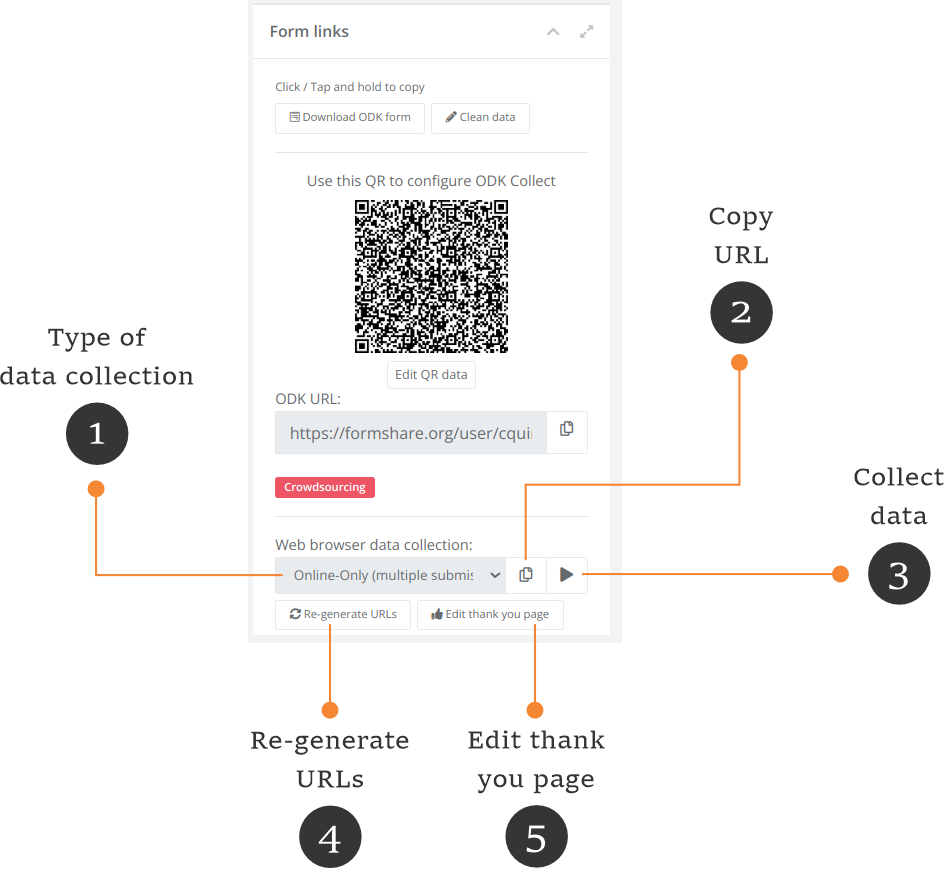
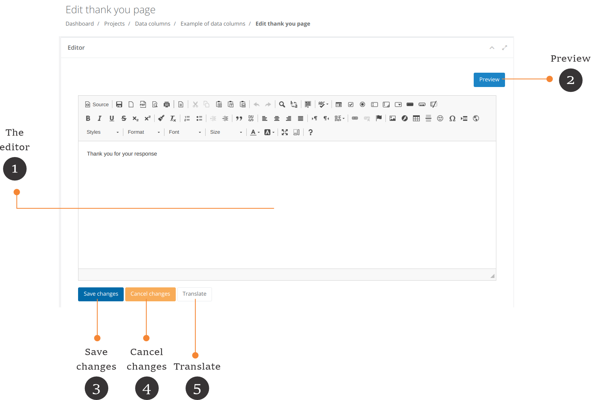

# Enketo plugin

[Enketo](https://enketo.org/) is open-source software that collects ODK data using a web browser. When FormShare has the Enketo plugin, each "Form details" page contains a section with Enketo options.

<figure><figcaption></figcaption></figure>

1. Type of data collection: Enketo can collect data in different ways:

* Online-Only (multiple submissions). Enketo can collect multiple submissions in this mode, but only if the device has an internet connection.
* Online-Offline (multiple submissions). Enketo can collect multiple submissions in this mode even if the device has lost its internet connection.
* Online-Only (single submission). Enketo will collect only one submission and then go to a "Thank you" page. This mode only works if the device has an internet connection. Enketo will allow you to open the link again and enter a new submission in this mode.
* Online-Only (once per respondent). Enketo will collect only one submission from the device. Enketo will redirect you to the "Thank you" page at the end of the survey or if the device has already filled out the form. This mode only works if the device has an internet connection.
* View only (for testing). Enketo will allow you to fill out the form, but it will not submit data to FormShare.

Each way has a different URL

2. Copy URL: Click on this button to copy the URL for each type of data collection. **You need to share this URL with data collection assistants**.
3. Collect data: Click this button to load Enketo using the selected type.
4. Re-generate URLs: This will generate the URLs for Enketo. If you upload a form to a FormShare installation with the Enketo plugin, FormShare will generate the URLs automatically. Use this button to generate the URLs of a created form before activating the Enketo plugin.
5. Edit the "Thank you" page: This applies when Enketo collects a single submission or once per respondent. Click on the "Edit thank you" page to personalize the "Thank you page". The editor will appear.

<figure><figcaption></figcaption></figure>

1. The editor: Create your "Thank You" page here. You can include images and links and format the text as necessary.
2. Preview: Click the "Preview" button to preview your page.
3. Save changes: Click the "Save changes" button to save your changes.
4. Cancel changes: Click the "Cancel changes" button to revert to the last saved page.
5. Translate: You can translate the same page in different languages. Click on the "Translate" button to set the new language. A sub-window will appear.

<figure><figcaption></figcaption></figure>

Indicate the language code and the language name. Use the [ISO 639 standard](https://en.wikipedia.org/wiki/List\_of\_ISO\_639\_language\_codes) to set the language code. Click on the "Translate" button to add the translation. The editor page will appear with an option to switch between translations.

<figure><figcaption></figcaption></figure>

1. Language: Use the language combo box to switch between the default language and translations.
2. Delete language: Click the "Delete language" button to delete a translation.
